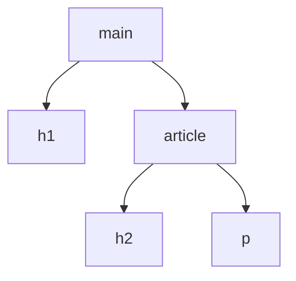

# Frontend — Biblioteca de conceptos

Esta biblioteca organiza el conocimiento de la materia por conceptos y no por el orden cronológico de las clases. El recorrido real de la cursada se conserva en `bitacora.md`.

# Fundamentos del desarrollo frontend

## Qué es el frontend

El **frontend** es la parte de una aplicación con la que la persona usuaria interactúa directamente. En una aplicación web comprende la interfaz que el navegador presenta y el comportamiento asociado a esa interfaz: contenido, navegación, controles, formularios, respuestas visuales e interacción.

El frontend no se limita a “lo que se ve”. También incluye la lógica que se ejecuta del lado del cliente para reaccionar a eventos, validar entradas, actualizar la interfaz, comunicarse con servicios externos y administrar el estado necesario para la experiencia de uso.

En una aplicación web moderna, tres tecnologías forman la base del frontend:

| Tecnología | Responsabilidad principal |
|---|---|
| **HTML** | Define el contenido, la estructura y la semántica del documento. |
| **CSS** | Define la presentación visual y el layout. |
| **JavaScript** | Incorpora comportamiento, lógica e interactividad. |

Estas responsabilidades se relacionan, pero conviene mantenerlas conceptualmente separadas. Una estructura HTML clara facilita aplicar estilos con CSS y comportamiento con JavaScript sin convertir el documento en una mezcla difícil de mantener.

## Herramientas y abstracciones del ecosistema

Sobre HTML, CSS y JavaScript existen herramientas que permiten desarrollar interfaces complejas con mayor organización.

Una **biblioteca** ofrece funcionalidades que el código de la aplicación puede utilizar. Una **framework** proporciona una estructura más amplia para construir la aplicación y establece convenciones sobre cómo organizar distintas partes del sistema.

Dos ejemplos mencionados en la materia son:

- **React**: biblioteca orientada a la construcción de interfaces de usuario mediante componentes.
- **Angular**: framework para construir aplicaciones web basado en componentes y con herramientas integradas para resolver necesidades como enrutamiento, formularios, inyección de dependencias y comunicación con servicios.

La materia se concentrará posteriormente en Angular. En esta primera etapa, estos nombres funcionan principalmente como panorama del ecosistema; sus conceptos específicos se desarrollarán cuando aparezcan en la cursada.

---

# HTML

## Qué es HTML

**HTML (HyperText Markup Language)** es el lenguaje de marcado estándar utilizado para describir la estructura y el significado del contenido de un documento web.

No es un lenguaje de programación de propósito general: HTML es un lenguaje **declarativo de marcado**. En lugar de expresar algoritmos mediante instrucciones, declara qué representa cada parte del contenido mediante elementos.

Por ejemplo:

```html
<h1>Noticias</h1>
<p>Últimas novedades del proyecto.</p>
```

El navegador interpreta ese marcado como un encabezado principal seguido de un párrafo.

HTML constituye el “esqueleto” estructural del documento, pero su función no es únicamente visual. Un marcado bien elegido también comunica significado a navegadores, tecnologías de asistencia, motores de búsqueda y código que procese el documento.

## Hipertexto y marcado

El nombre HTML combina dos ideas:

- **HyperText**: documentos que pueden relacionarse entre sí mediante enlaces.
- **Markup**: contenido anotado mediante marcas que describen su estructura y significado.

Las marcas de HTML se expresan mediante **etiquetas**, que forman elementos.

```html
<p>Este contenido pertenece a un párrafo.</p>
```

Aquí:

- `<p>` es la etiqueta de apertura;
- `Este contenido pertenece a un párrafo.` es el contenido;
- `</p>` es la etiqueta de cierre;
- el conjunto completo constituye un elemento `<p>`.

## Elementos, etiquetas y contenido

Es útil distinguir **etiqueta** de **elemento**.

Una etiqueta es la sintaxis escrita entre `<` y `>`. Un elemento es la estructura completa representada por esa sintaxis, que puede incluir etiqueta de apertura, atributos, contenido y etiqueta de cierre.

```html
<a href="/contacto">Contacto</a>
```

En este caso:

- `<a href="/contacto">` es la etiqueta de apertura;
- `href="/contacto"` es un atributo;
- `Contacto` es el contenido;
- `</a>` es la etiqueta de cierre;
- todo el conjunto es el elemento de enlace.

Muchos elementos poseen apertura y cierre, pero HTML también define **elementos vacíos** (*void elements*) que no contienen nodos hijos y no utilizan etiqueta de cierre, como:

```html

```

Por eso no debe asumirse que toda etiqueta HTML posee necesariamente una pareja de cierre.

## Estructura jerárquica y árbol del documento

Los elementos HTML se anidan unos dentro de otros y forman una estructura jerárquica.

```html
<main>
  <h1>Productos</h1>
  <article>
    <h2>Producto destacado</h2>
    <p>Descripción del producto.</p>
  </article>
</main>
```

En esta estructura:

- `main` contiene a `h1` y `article`;
- `h1` y `article` son **hermanos**, porque comparten el mismo padre;
- `article` es padre de `h2` y `p`;
- `h2` y `p` son hermanos.

Esta relación puede representarse como un árbol:



El navegador transforma el documento HTML en una representación en memoria que posteriormente podrá manipularse desde JavaScript: el **DOM (Document Object Model)**. El DOM se estudiará con mayor profundidad cuando la materia avance sobre JavaScript y manipulación de interfaces.

## Estructura básica de un documento HTML

Una base moderna mínima puede escribirse así:

```html
<!doctype html>
<html lang="es">
  <head>
    <meta charset="UTF-8">
    <meta name="viewport" content="width=device-width, initial-scale=1.0">
    <title>Mi aplicación</title>
  </head>
  <body>
    <h1>Contenido principal</h1>
    <p>Primer documento HTML.</p>
  </body>
</html>
```

### `<!doctype html>`

Declara que el documento debe interpretarse como HTML moderno. Aunque históricamente los *doctypes* estuvieron asociados a definiciones concretas del lenguaje, en HTML actual `<!doctype html>` cumple principalmente la función de hacer que el navegador utilice su modo de renderizado estándar.

### `<html>`

Es el elemento raíz del documento. El resto de los elementos HTML son descendientes suyos.

El atributo `lang` identifica el idioma principal del documento:

```html
<html lang="es">
```

Esta información es relevante, entre otras cosas, para tecnologías de asistencia y para herramientas que procesan el contenido.

### `<head>`

Contiene metadatos y recursos asociados al documento, no el contenido principal que se presenta dentro de la página.

Entre sus usos habituales se encuentran:

- establecer el título del documento con `<title>`;
- declarar la codificación con `<meta charset="UTF-8">`;
- añadir metadatos;
- enlazar hojas de estilo;
- relacionar iconos u otros recursos;
- cargar determinados scripts.

Ejemplo:

```html
<head>
  <meta charset="UTF-8">
  <title>Catálogo</title>
  <link rel="stylesheet" href="styles.css">
</head>
```

### `<body>`

Representa el contenido del documento: encabezados, párrafos, navegación, imágenes, formularios, secciones y demás elementos que forman la página.

```html
<body>
  <h1>Catálogo</h1>
  <p>Productos disponibles.</p>
</body>
```

## Cómo procesa el navegador el HTML

El navegador recibe el código fuente HTML como una secuencia y lo **parsea** para construir el DOM.

Como modelo inicial resulta útil pensar que el parser avanza siguiendo el orden del documento. Sin embargo, no debe interpretarse esto como la regla informal de que “cualquier etiqueta de cierre puede ponerse en cualquier lugar”. HTML posee reglas precisas de anidamiento y cierre.

Los navegadores pueden corregir automáticamente ciertos errores de marcado para poder mostrar una página, pero que el navegador produzca algún resultado no significa que el HTML sea correcto.

Por ejemplo, esta estructura es clara y correctamente anidada:

```html
<article>
  <h2>Título</h2>
  <p>Contenido.</p>
</article>
```

Un documento bien estructurado reduce resultados inesperados y facilita accesibilidad, estilos, mantenimiento y manipulación mediante JavaScript.

---

# Semántica en HTML

## Qué significa semántica

La **semántica** describe el significado de un elemento, no simplemente su apariencia.

Por ejemplo:

```html
<nav>
  ...
</nav>
```

comunica que el contenido constituye una zona de navegación.

En cambio:

```html
<div>
  ...
</div>
```

define un contenedor genérico sin expresar por sí mismo qué función cumple ese bloque.

HTML incluye elementos estructurales como:

- `<header>`;
- `<nav>`;
- `<main>`;
- `<section>`;
- `<article>`;
- `<aside>`;
- `<footer>`.

También existen muchos otros elementos cuyo significado es semántico aunque no pertenezcan específicamente al grupo de elementos estructurales, como `<a>`, `<button>`, ``, `<form>` o los encabezados `<h1>` a `<h6>`.

Por lo tanto, “semántico” no significa simplemente “tener un nombre que describe una zona de la página”; se refiere a utilizar el elemento que expresa correctamente el significado y propósito del contenido.

## Semántica frente a contenedores genéricos

`<div>` y `<span>` son contenedores genéricos útiles cuando no existe un elemento con una semántica más apropiada.

Un sitio podría construirse visualmente con numerosos `<div>` y CSS, pero hacerlo de manera indiscriminada elimina información estructural que HTML ya puede expresar.

Por ejemplo:

```html
<div class="nav">
  <a href="/">Inicio</a>
  <a href="/contacto">Contacto</a>
</div>
```

puede sustituirse, cuando corresponde conceptualmente, por:

```html
<nav>
  <a href="/">Inicio</a>
  <a href="/contacto">Contacto</a>
</nav>
```

Ambos bloques pueden verse idénticos después de aplicar CSS, pero el segundo comunica además que se trata de navegación.

## Por qué importa el HTML semántico

### Mantenibilidad

Un elemento adecuado permite comprender más rápidamente la intención del código.

```html
<header>...</header>
<main>...</main>
<footer>...</footer>
```

expresa más información que una sucesión de contenedores genéricos sin nombres claros.

Esto cobra especial importancia cuando un proyecto debe ser modificado meses después o pasa de una persona a otra.

### Accesibilidad

Muchos elementos HTML aportan semántica que las tecnologías de asistencia pueden utilizar.

Los lectores de pantalla y otras herramientas pueden beneficiarse de:

- regiones estructurales;
- niveles correctos de encabezados;
- enlaces reales;
- botones reales;
- etiquetas asociadas a controles de formulario;
- texto alternativo apropiado para imágenes.

La accesibilidad no depende solamente de utilizar etiquetas estructurales, pero un HTML semántico correcto proporciona una base importante.

### SEO

La estructura y la semántica del HTML ayudan a los motores de búsqueda a interpretar el contenido.

Sin embargo, utilizar `<main>`, `<article>` o `<footer>` no garantiza por sí mismo una posición determinada en los resultados. El **SEO (Search Engine Optimization)** comprende un conjunto mucho mayor de prácticas relacionadas con contenido, rastreo, indexación, rendimiento, metadatos, enlaces y otros factores.

Por eso, la relación correcta es:

> El HTML semántico contribuye a que el contenido sea interpretable y forma parte de una buena base técnica para SEO; no constituye por sí solo una estrategia completa de posicionamiento.

---

# Metadatos

Los **metadatos** son información que describe o complementa otros datos.

En un documento HTML, el `<head>` actúa como contenedor de buena parte de la información asociada al documento.

Ejemplos:

```html
<meta charset="UTF-8">
<meta name="description" content="Catálogo de productos tecnológicos">
```

El primer elemento define la codificación de caracteres. El segundo aporta una descripción del documento.

No todos los metadatos de interés se expresan mediante `<meta>`. Por ejemplo:

```html
<title>Catálogo</title>
<link rel="stylesheet" href="styles.css">
```

también forman parte de la información y recursos asociados al documento dentro de `<head>`.

El idioma principal, por otra parte, se declara normalmente mediante el atributo `lang` del elemento raíz:

```html
<html lang="es">
```

---

# Atributos HTML

## Qué es un atributo

Los **atributos** agregan información a un elemento o configuran determinadas características de su comportamiento.

Se escriben normalmente en la etiqueta de apertura.

```html
<a href="/perfil" class="enlace-principal">Mi perfil</a>
```

Aquí:

- `href` indica el destino del enlace;
- `class` asigna una clase que puede utilizarse desde CSS o JavaScript.

La forma más habitual es:

```text
nombre="valor"
```

pero no todos los atributos necesitan un valor textual explícito.

## Atributos booleanos

HTML define atributos booleanos cuya presencia representa el valor verdadero.

Por ejemplo:

```html
<input type="text" disabled>
```

La presencia de `disabled` deshabilita el control. Por eso, aunque el modelo “nombre–valor” es útil para muchos atributos, no es una regla universal de la sintaxis HTML.

## Atributos globales y específicos

Algunos atributos pueden aplicarse a gran cantidad de elementos, como:

- `id`;
- `class`;
- `title`;
- `lang`;
- `hidden`.

Otros pertenecen a elementos concretos:

```html
<a href="/inicio">Inicio</a>

```

`href` tiene sentido para el enlace y `src`/`alt` para la imagen.

## `class` y separación entre estructura y presentación

El atributo `class` permite identificar uno o varios elementos para aplicar reglas CSS o seleccionarlos desde JavaScript.

```html
<p class="destacado">Contenido importante</p>
```

```css
.destacado {
  font-weight: bold;
}
```

HTML también permite utilizar el atributo `style`:

```html
<p style="font-weight: bold">Contenido importante</p>
```

Este código es válido, pero en proyectos mantenibles suele preferirse separar la estructura HTML de las reglas de presentación, concentrando los estilos en CSS. Esto facilita reutilización, consistencia y mantenimiento.

---

# JavaScript

## Qué es JavaScript

**JavaScript** es un lenguaje de programación de propósito general estandarizado mediante **ECMAScript**. Nació vinculado al navegador y al desarrollo de páginas web interactivas, pero actualmente también se ejecuta fuera del navegador mediante entornos como Node.js.

En frontend permite, entre otras cosas:

- reaccionar a acciones del usuario;
- modificar contenido y estado de la interfaz;
- validar y procesar datos;
- trabajar con eventos;
- comunicarse con servicios;
- coordinar operaciones asincrónicas;
- manipular el DOM.

HTML aporta principalmente estructura y semántica, CSS presentación y JavaScript comportamiento y lógica.

## Breve evolución

JavaScript apareció en 1995 en Netscape y fue creado por Brendan Eich. Antes de adoptar su nombre actual pasó por los nombres Mocha y LiveScript.

Posteriormente comenzó su estandarización mediante Ecma International. El lenguaje estandarizado se denomina **ECMAScript** y se especifica en ECMA-262.

**ECMAScript 2015 (ES6)** incorporó numerosas características fundamentales del JavaScript moderno, entre ellas `let`, `const` y las funciones flecha.

La aparición de **Node.js** extendió fuertemente el uso de JavaScript fuera del navegador.

## Lenguaje de alto nivel, dinámico y multiparadigma

JavaScript es un lenguaje de **alto nivel**: abstrae detalles como la administración manual de memoria y ofrece construcciones apropiadas para trabajar con conceptos de mayor nivel.

También es **multiparadigma** y permite combinar programación:

- imperativa;
- funcional;
- orientada a objetos;
- dirigida por eventos.

### Tipado dinámico

El tipo pertenece al valor, no queda fijado permanentemente a una variable.

```javascript
let dato = 10;
dato = "diez";
dato = true;
```

Una misma variable puede referenciar valores de tipos distintos durante la ejecución.

### Coerción de tipos

JavaScript puede realizar conversiones implícitas según la operación:

```javascript
console.log("1" + 1); // "11"
```

En este caso el número se convierte implícitamente en texto y `+` produce concatenación.

Esta flexibilidad suele relacionarse con la descripción de JavaScript como un lenguaje de tipado débil, aunque “fuerte” y “débil” no poseen una única definición formal universal. Resulta más útil comprender las reglas concretas de **coerción**.

También pueden realizarse conversiones explícitas:

```javascript
Number("42");  // 42
String(42);    // "42"
Boolean(1);    // true
```

## ECMAScript, motor y entorno

Conviene separar tres conceptos.

### ECMAScript

Es la especificación que define el núcleo del lenguaje.

### Motor de JavaScript

Es el software que implementa ECMAScript y ejecuta el código.

Entre los motores conocidos se encuentran:

- **V8**, utilizado por Chrome y Node.js;
- **SpiderMonkey**, utilizado por Firefox;
- **JavaScriptCore**, utilizado por Safari.

Los motores modernos no se limitan a “interpretar línea por línea”: utilizan análisis, interpretación y **compilación JIT (Just-In-Time)** para optimizar la ejecución.

Por eso, afirmar simplemente que JavaScript “es interpretado y no compilado” es una simplificación. Desde el punto de vista de quien desarrolla no suele existir un paso manual de compilación previo para ejecutar JavaScript común, pero internamente los motores modernos sí compilan y optimizan código.

### Entorno anfitrión

El motor implementa el lenguaje; el entorno proporciona APIs adicionales.

En un navegador aparecen, por ejemplo:

- DOM;
- eventos;
- `fetch`;
- temporizadores;
- almacenamiento web.

Node.js proporciona otras APIs para archivos, procesos, red y servidores.

## Script y algoritmo

Un **algoritmo** describe de manera abstracta un procedimiento para resolver un problema. Puede expresarse con lenguaje natural, pseudocódigo, diagramas o código.

Un **script** es código concreto escrito en un lenguaje y ejecutable dentro de un entorno.

Por lo tanto, un script puede implementar uno o varios algoritmos, pero ambos conceptos no son equivalentes.

---

# Variables y bindings

## `let`

`let` declara un binding con **alcance de bloque** y permite reasignarlo.

```javascript
let contador = 1;
contador = 2;
```

No permite redeclarar el mismo identificador dentro del mismo ámbito:

```javascript
let contador = 1;
// let contador = 2; // SyntaxError
```

## `const`

`const` también tiene alcance de bloque, pero exige inicialización y no permite reasignar el binding.

```javascript
const PI = 3.14159;
// PI = 3; // TypeError
```

Esto no vuelve inmutable al valor si se trata de un objeto:

```javascript
const usuario = {
  nombre: "Ana"
};

usuario.nombre = "Lucía"; // válido
usuario.edad = 30;        // válido

// usuario = {};          // TypeError
```

La restricción de `const` afecta a la reasignación de la variable, no a todas las mutaciones internas del valor.

Como regla general para código moderno:

- usar `const` cuando no haga falta reasignar;
- usar `let` cuando sí;
- evitar `var` salvo necesidad concreta o código legado.

## `var`

`var` es anterior a `let` y `const` y posee diferencias importantes:

- tiene alcance de función, no de bloque;
- permite redeclaración;
- posee comportamientos históricos de *hoisting* que pueden resultar poco intuitivos.

```javascript
function ejemplo() {
  if (true) {
    var mensaje = "hola";
  }

  console.log(mensaje); // "hola"
}
```

Con `let`, el binding queda limitado al bloque:

```javascript
function ejemplo() {
  if (true) {
    let mensaje = "hola";
  }

  // console.log(mensaje); // ReferenceError
}
```

### Hoisting de `var`

Una declaración `var` pertenece al ámbito completo de la función aunque la asignación permanezca en su posición original.

```javascript
function ejemplo(condicion) {
  if (condicion) {
    var valor = 10;
  }

  console.log(valor);
}

ejemplo(false); // undefined
```

La declaración existe en el ámbito de la función, pero como la rama del `if` no se ejecutó, nunca ocurrió `valor = 10`.

## No crear variables implícitas

Código como:

```javascript
resultado = 10;
```

puede crear una propiedad global accidental en scripts clásicos no estrictos.

No debe utilizarse como forma de declaración.

En modo estricto y en módulos JavaScript produce un `ReferenceError`. Los bindings deben declararse explícitamente.

---

# Scope o alcance

El **scope** determina en qué parte del programa puede resolverse un identificador.

JavaScript posee:

- alcance global;
- alcance de módulo;
- alcance de función;
- alcance de bloque.

`let` y `const` respetan alcance de bloque:

```javascript
if (true) {
  const mensaje = "visible aquí";
}

// console.log(mensaje); // ReferenceError
```

`var` no queda limitado por un bloque común:

```javascript
if (true) {
  var mensaje = "visible fuera del if";
}

console.log(mensaje);
```

Una función sí crea un ámbito para `var`:

```javascript
function ejemplo() {
  var local = 10;
}

// console.log(local); // ReferenceError
```

Los ámbitos se anidan: el código interno puede acceder a bindings externos disponibles, pero el código externo no puede acceder directamente a bindings locales internos.

---

# Tipos de datos

## Primitivos

JavaScript define siete tipos primitivos:

| Tipo | Ejemplo |
|---|---|
| `string` | `"hola"` |
| `number` | `42`, `3.14` |
| `bigint` | `123n` |
| `boolean` | `true`, `false` |
| `undefined` | `undefined` |
| `symbol` | `Symbol("id")` |
| `null` | `null` |

Los primitivos son **inmutables**: una operación no modifica internamente el valor primitivo original; una reasignación hace que el binding pase a contener otro valor.

### `null`

`null` representa intencionalmente ausencia de valor:

```javascript
let seleccion = null;
```

Es un valor primitivo, aunque por una particularidad histórica:

```javascript
typeof null; // "object"
```

Ese resultado no significa que `null` sea realmente un objeto.

### `undefined`

`undefined` aparece habitualmente cuando un binding o una propiedad no posee otro valor definido.

```javascript
let resultado;

console.log(resultado); // undefined
```

Una distinción útil:

- `null`: ausencia establecida deliberadamente;
- `undefined`: valor todavía no definido o inexistente en ese acceso.

## Valores truthy y falsy

En condiciones, JavaScript puede convertir valores a booleanos.

Entre los valores **falsy** se encuentran:

```text
false
0
-0
0n
""
null
undefined
NaN
```

Por ejemplo:

```javascript
const dato = null;

if (dato) {
  // no se ejecuta
}
```

---

# Objetos

Los valores no primitivos pertenecen al tipo `object`.

```javascript
const vendedor = {
  nombre: "Carlos",
  apellido: "Sánchez",
  edad: 56
};
```

Cada propiedad asocia una clave con un valor.

```text
nombre   → "Carlos"
apellido → "Sánchez"
edad     → 56
```

Las propiedades pueden almacenar primitivas, arrays, otros objetos o funciones.

## Acceso y modificación

```javascript
console.log(vendedor.nombre);

vendedor.nombre = "Juan";
vendedor.email = "juan@example.com";
```

Esto es compatible con `const` porque se modifica el objeto, no se reasigna la variable `vendedor`.

---

# Arrays

Un **array** es un objeto especializado para representar colecciones ordenadas.

```javascript
const habilidades = [
  "comunicación",
  "puntualidad",
  "negociación"
];
```

Sus índices comienzan en `0`:

```javascript
console.log(habilidades[0]); // "comunicación"
console.log(habilidades[1]); // "puntualidad"
```

JavaScript permite mezclar tipos:

```javascript
const datos = [
  10,
  "texto",
  true,
  { nombre: "Ana" },
  [1, 2, 3]
];
```

Entre los métodos anticipados en la clase están:

- `push`;
- `pop`;
- `shift`;
- `unshift`;
- `map`;
- `filter`.

Se desarrollarán cuando sean utilizados en ejercicios.

---

# Funciones

Una **función** agrupa instrucciones reutilizables que pueden ejecutarse cuando la función es invocada.

```javascript
function saludar() {
  console.log("Hola");
}

saludar();
```

Las funciones pueden:

- recibir datos;
- realizar operaciones;
- producir efectos;
- devolver valores;
- almacenarse en variables o propiedades;
- pasarse como argumentos.

En JavaScript son valores de primera clase.

## Parámetros y argumentos

```javascript
function saludar(nombre) {
  console.log(`Hola ${nombre}`);
}

saludar("Ana");
```

- `nombre` es un **parámetro**;
- `"Ana"` es un **argumento**.

## Métodos

Cuando una función se almacena como propiedad de un objeto y se invoca a través de él, suele denominarse **método**.

```javascript
const vendedor = {
  nombre: "Carlos",

  vender() {
    console.log(`${this.nombre} vendió un producto`);
  }
};

vendedor.vender();
```

La diferencia entre función y método no depende de que exista o no un valor de retorno.

## Funciones tradicionales

```javascript
function sumar(a, b) {
  return a + b;
}
```

También pueden escribirse como expresión:

```javascript
const sumar = function (a, b) {
  return a + b;
};
```

## Funciones flecha

```javascript
const sumar = (a, b) => {
  return a + b;
};
```

Si el cuerpo es una única expresión:

```javascript
const sumar = (a, b) => a + b;
```

Las arrow functions no son solo una abreviatura de `function`.

### `this` léxico

Una función tradicional usada como método puede recibir `this` según cómo se invoca:

```javascript
const persona = {
  nombre: "Ana",

  mostrarNombre() {
    console.log(this.nombre);
  }
};
```

Una arrow function **no crea su propio `this`**: captura el `this` del contexto exterior.

```javascript
const persona = {
  nombre: "Ana",

  mostrarNombre: () => {
    console.log(this.nombre);
  }
};
```

No debe suponerse que en este segundo caso `this` sea `persona`.

La arrow puede acceder a datos del objeto mediante parámetros u otras referencias explícitas; la diferencia específica está en el comportamiento de `this`.

Las arrow functions tampoco pueden utilizarse como constructor con `new`.

---

# Callbacks

Un **callback** es una función que se pasa a otra función para que esta pueda utilizarla.

```javascript
function ejecutar(callback) {
  callback();
}

function informar() {
  console.log("Callback ejecutado");
}

ejecutar(informar);
```

En:

```javascript
function ejecutar(callback)
```

`callback` es un parámetro.

En:

```javascript
ejecutar(informar);
```

`informar` es el argumento y además cumple el rol de callback.

También es habitual:

```javascript
ejecutar(() => {
  console.log("Callback ejecutado");
});
```

Los callbacks aparecen en eventos, métodos de arrays, temporizadores y APIs asincrónicas.

Un callback **no es necesariamente asincrónico**: también puede ejecutarse inmediatamente de forma síncrona.

---

# Asignación de primitivos y objetos

## Primitivos: copia del valor

```javascript
let a = 10;
let b = a;

a = 20;

console.log(a); // 20
console.log(b); // 10
```

El valor de `b` es independiente de la posterior reasignación de `a`.

## Objetos: referencia compartida

```javascript
const objeto1 = {
  nombre: "Carlos"
};

const objeto2 = objeto1;

objeto1.nombre = "Juan";

console.log(objeto2.nombre); // "Juan"
```

Ambos bindings permiten acceder al mismo objeto.

Un modelo mental útil:

```text
objeto1 ──┐
          ├──> { nombre: "Juan" }
objeto2 ──┘
```

Esto no significa que los objetos “no ocupen memoria”. Es una abstracción para comprender la semántica observable: al asignar un objeto a otra variable, se copia la referencia al mismo objeto, no se crea automáticamente un clon independiente.

## Comparación

```javascript
const a = { valor: 1 };
const b = { valor: 1 };

console.log(a === b); // false
```

Son dos objetos distintos.

```javascript
const a = { valor: 1 };
const b = a;

console.log(a === b); // true
```

Aquí ambos bindings refieren al mismo objeto.

---

# Gestión automática de memoria

JavaScript administra memoria automáticamente mediante mecanismos de **garbage collection**.

```javascript
let dato = {
  contenido: "temporal"
};

dato = null;
```

Si el objeto anterior deja de ser alcanzable desde el programa, el motor puede considerarlo candidato para recuperar su memoria.

El programa no controla el momento exacto en que ocurrirá la recolección.

---

# Temas abiertos de JavaScript

Quedaron anunciados para continuar:

- comportamiento de `const` con objetos y otras estructuras mutables;
- eventos;
- profundización en funciones;
- asincronía y promesas;
- DOM.

Estas secciones se ampliarán cuando la cursada las desarrolle.

---

# Panorama de la cursada técnica

La materia parte de los fundamentos de HTML y CSS para concentrarse posteriormente en JavaScript y Angular.

Dentro de Angular se anticiparon temas como:

- componentes;
- comunicación entre componentes;
- servicios;
- inyección de dependencias;
- enrutamiento;
- directivas;
- estructuras de control;
- pipes;
- formularios reactivos;
- formularios basados en plantillas;
- integración del frontend con un backend.

Estos conceptos se incorporarán a la biblioteca cuando sean desarrollados efectivamente por la cursada.

## Convención de Angular indicada por la cátedra

La cátedra indicó trabajar con **Angular 17 o superior** y priorizar la sintaxis moderna.

Angular 17 introdujo la nueva sintaxis de control de flujo incorporada en las plantillas, con construcciones como `@if` y `@for`.

Es importante distinguir este cambio de la arquitectura *standalone*: los componentes standalone existían antes de Angular 17 y los `NgModule` no desaparecieron en esa versión. Angular continúa soportando aplicaciones basadas en módulos, aunque el enfoque standalone es el estilo moderno y actualmente preferido para código nuevo.

Esta distinción permite conservar la decisión práctica de la materia —trabajar con Angular moderno— sin convertir una simplificación oral en una regla histórica incorrecta.

---

# Referencias técnicas

- MDN Web Docs — JavaScript Guide: https://developer.mozilla.org/docs/Web/JavaScript/Guide
- MDN Web Docs — JavaScript execution model: https://developer.mozilla.org/docs/Web/JavaScript/Reference/Execution_model
- MDN Web Docs — Grammar and types: https://developer.mozilla.org/docs/Web/JavaScript/Guide/Grammar_and_types
- MDN Web Docs — `let`: https://developer.mozilla.org/docs/Web/JavaScript/Reference/Statements/let
- MDN Web Docs — `const`: https://developer.mozilla.org/docs/Web/JavaScript/Reference/Statements/const
- MDN Web Docs — `var`: https://developer.mozilla.org/docs/Web/JavaScript/Reference/Statements/var
- MDN Web Docs — Arrow functions: https://developer.mozilla.org/docs/Web/JavaScript/Reference/Functions/Arrow_functions
- MDN Web Docs — Data structures: https://developer.mozilla.org/docs/Web/JavaScript/Data_structures
- MDN Web Docs — Memory management: https://developer.mozilla.org/docs/Web/JavaScript/Guide/Memory_management

- MDN Web Docs — HTML: https://developer.mozilla.org/docs/Web/HTML
- MDN Web Docs — HTML semántico y accesibilidad: https://developer.mozilla.org/docs/Learn_web_development/Core/Accessibility/HTML
- Angular — documentación oficial: https://angular.dev/
- Angular — migración a control flow: https://angular.dev/reference/migrations/control-flow
- Angular — migración a standalone: https://angular.dev/reference/migrations/standalone
