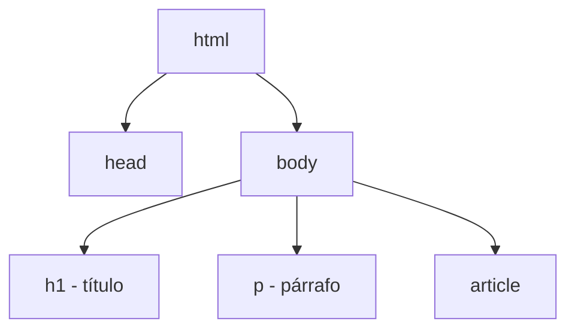

# Frontend — Biblioteca de Conceptos


> Este archivo se organiza por concepto, no cronológicamente. Para el orden real en que se dictaron las clases, ver `bitacora.md` y el historial de commits.

## HTML

### 1. Qué es HTML

HTML (HyperText Markup Language, lenguaje de marcado de hipertexto) no es un lenguaje de programación sino un **lenguaje de marcado**: no tiene lógica, su función es estructurar contenido, no procesarlo. "Marcado" indica que se usan distintas marcas o etiquetas para indicarle al navegador qué mostrar y cómo interpretarlo.

Es el lenguaje estándar para crear páginas o aplicaciones web: describe la estructura o el "esqueleto" de la página, con un orden que le explica al navegador qué mostrar y cómo. Se compone de etiquetas que forman distintos elementos (párrafos, títulos, imágenes, vínculos, cabeceras, secciones, etc.).

### 2. Metadatos

Los metadatos son "datos sobre los datos": información que complementa o explica al contenido, pero que en general no es visible para el usuario final (por ejemplo, el idioma del documento, la codificación de caracteres, o la versión de HTML utilizada). En HTML, buena parte de esta información vive dentro de la etiqueta `<head>`.

### 3. Estructura de HTML: modelo de árbol

HTML tiene una estructura jerárquica tipo árbol, con un nodo principal del cual se desprenden otros nodos llamados **hijos**. Los nodos que comparten el mismo padre se llaman **hermanos** entre sí. Un elemento puede contener otros elementos anidados dentro suyo (por ejemplo, un `<main>` puede contener un título y un párrafo; el párrafo, a su vez, podría contener otro elemento).



En este ejemplo, `head` y `body` son hermanos entre sí (ambos hijos de `html`), y `h1`, `p` y `article` son hermanos entre sí (todos hijos de `body`).

### 4. Estructura básica de un documento HTML

Un documento HTML tiene la siguiente estructura general:

```html
<html>
  <head>
    <!-- metadatos, título, importación de CSS, etc. -->
  </head>
  <body>
    <h1>Título</h1>
    <p>Párrafo de contenido.</p>
  </body>
</html>
```

- **`<head>`**: contiene información que el usuario no ve directamente (metadatos, codificación, idioma, título de la pestaña) y es también donde se importa el CSS que va a afectar al documento.
- **`<body>`**: contiene todo el contenido visible para el usuario (títulos, párrafos, imágenes, etc.).

> **El navegador lee el documento de arriba hacia abajo y de izquierda a derecha.** Una etiqueta de cierre puede aparecer en distintas posiciones del código y seguir siendo válida, pero el orden de lectura siempre es ese.

### 5. Etiquetas HTML

Una etiqueta HTML es un fragmento de código que permite crear un elemento HTML; los elementos son la estructura básica del documento. Da formato, funcionalidad y estructura al contenido.

En la mayoría de los casos, una etiqueta consta de tres partes:

| Parte | Forma | Ejemplo |
|---|---|---|
| Apertura | `<nombre>` | `<p>` |
| Contenido | texto u otras etiquetas anidadas | `Hola mundo` |
| Cierre | `</nombre>` (con barra antes del nombre) | `</p>` |

La diferencia entre apertura y cierre es esa barra (`/`) antes del nombre de la etiqueta en el cierre.

### 6. Etiquetas semánticas vs. no semánticas

Una **etiqueta semántica** es aquella que define el significado del contenido que engloba: indica qué tipo de contenido tiene y qué función cumple. Por ejemplo, `<footer>` indica que ese bloque es el pie de página; `<main>` indica el contenido principal; `<article>` indica un contenido independiente del resto.

Una **etiqueta no semántica** (por ejemplo `<div>` o `<span>`) no indica ningún tipo de contenido ni función particular — es genérica y se puede usar para cualquier cosa.

Visualmente, reemplazar una etiqueta semántica por un `<div>` con la misma clase y el mismo CSS puede producir el mismo resultado en pantalla. La diferencia no está en lo visual sino en:

- **Legibilidad del código** para quien lo desarrolla o lo retoma después (usar `<div>` para todo dificulta entender la estructura de un vistazo).
- **Accesibilidad**: los lectores de pantalla que usan las personas con dificultades visuales interpretan mejor una etiqueta semántica (que ya "sabe" para qué sirve) que una genérica.
- **SEO**: los rastreadores de los buscadores entienden mejor el contenido de un sitio cuando está semánticamente bien marcado, lo que da una ventaja competitiva en el posicionamiento frente a sitios que no lo usan.

Otro ejemplo de etiquetas con función fija (aunque no se las suela agrupar bajo "semánticas" en el mismo sentido que `footer`/`main`/`article`): `` (imagen) solo sirve para insertar imágenes, y `<a>` (ancla) solo sirve para crear vínculos — a diferencia de `<div>`, que no tiene una función predefinida.

### 7. SEO (Search Engine Optimization)

SEO es un conjunto de acciones orientadas a mejorar el posicionamiento de un sitio web en los resultados de los buscadores. Incluye aspectos técnicos (estructura del documento, metadatos) y también el nivel de contenido.

Usar HTML semánticamente correcto no "hace" SEO por sí solo, pero sí es uno de los factores que contribuye a un mejor posicionamiento, además de mejorar la accesibilidad del sitio.

### 8. Atributos HTML

Un atributo es un valor adicional que configura una etiqueta o ajusta su comportamiento para cumplir un criterio determinado. Siempre se componen de dos partes: **nombre (o propiedad) y valor**, con la estructura `nombre="valor"`.

Por ejemplo, el atributo `class` indica a qué clase pertenece una etiqueta: `class="red"` indica que esa etiqueta pertenece a la clase `red`, cuyo estilo (por ejemplo, color rojo) se va a definir después en CSS.

> El atributo `style` permite poner el color (u otro estilo) directo en la etiqueta y funciona, pero no es lo correcto: la etiqueta debería llevar un `class`, y ese estilo se define en CSS, no en el HTML.