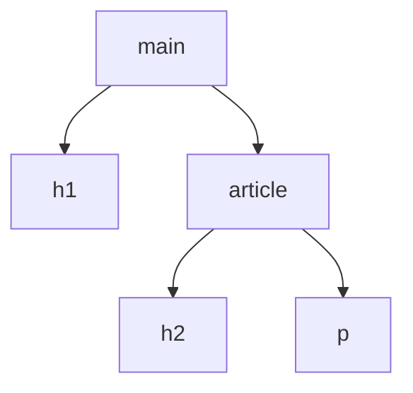
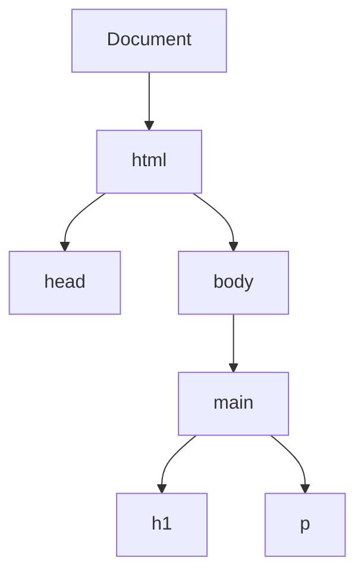

# Frontend — Biblioteca de conceptos

Esta biblioteca organiza el conocimiento de la materia por conceptos y no por el orden cronológico de las clases. El recorrido real de la cursada se conserva en `bitacora.md`.

## Índice

- [Fundamentos del desarrollo frontend](#fundamentos-del-desarrollo-frontend)
- [HTML](#html)
  - [Semántica, metadatos y atributos](#semántica-en-html)
- [JavaScript](#javascript)
  - [JSON](#json)
  - [Variables, scope y tipos](#variables-y-bindings)
  - [Arrays](#arrays)
  - [Funciones y callbacks](#funciones)
  - [Asincronía](#asincronía)
  - [Módulos](#módulos-de-javascript)
- [DOM y APIs del navegador](#dom-y-apis-del-navegador)
  - [Selección y manipulación](#qué-es-el-dom)
  - [Eventos](#eventos)
  - [Formularios y contenido dinámico](#formularios-y-valores)
- [CSS](#css)
  - [Selectores, cascada y especificidad](#selectores-css)
  - [Box model y unidades](#box-model)
  - [Display y posicionamiento](#display-y-flujo-normal)
  - [Animaciones y transiciones](#animaciones-css)
  - [Flexbox y Grid](#layout-moderno-flexbox-y-grid)
  - [Responsive design](#responsive-design-y-media-queries)
- [Temas abiertos](#temas-abiertos)
- [Referencias técnicas](#referencias-técnicas)

---

# Fundamentos del desarrollo frontend

## Qué es el frontend

El **frontend** es la parte de una aplicación con la que la persona usuaria interactúa directamente. En una aplicación web comprende la interfaz que el navegador presenta y el comportamiento asociado a esa interfaz: contenido, navegación, controles, formularios, respuestas visuales e interacción.

El frontend no se limita a “lo que se ve”. También incluye la lógica que se ejecuta del lado del cliente para reaccionar a eventos, validar entradas, actualizar la interfaz, comunicarse con servicios externos y administrar el estado necesario para la experiencia de uso.

En una aplicación web moderna, tres tecnologías forman la base del frontend:

| Tecnología | Responsabilidad principal |
|---|---|
| **HTML** | Define el contenido, la estructura y la semántica del documento. |
| **CSS** | Define la presentación visual y el layout. |
| **JavaScript** | Incorpora comportamiento, lógica e interactividad. |

Estas responsabilidades se relacionan, pero conviene mantenerlas conceptualmente separadas. Una estructura HTML clara facilita aplicar estilos con CSS y comportamiento con JavaScript sin convertir el documento en una mezcla difícil de mantener.

## Herramientas y abstracciones del ecosistema

Sobre HTML, CSS y JavaScript existen herramientas que permiten desarrollar interfaces complejas con mayor organización.

Una **biblioteca** ofrece funcionalidades que el código de la aplicación puede utilizar. Una **framework** proporciona una estructura más amplia para construir la aplicación y establece convenciones sobre cómo organizar distintas partes del sistema.

Dos ejemplos mencionados en la materia son:

- **React**: biblioteca orientada a la construcción de interfaces de usuario mediante componentes.
- **Angular**: framework para construir aplicaciones web basado en componentes y con herramientas integradas para resolver necesidades como enrutamiento, formularios, inyección de dependencias y comunicación con servicios.

La materia se concentrará posteriormente en Angular. En esta primera etapa, estos nombres funcionan principalmente como panorama del ecosistema; sus conceptos específicos se desarrollarán cuando aparezcan en la cursada.

---

# HTML

## Qué es HTML

**HTML (HyperText Markup Language)** es el lenguaje de marcado estándar utilizado para describir la estructura y el significado del contenido de un documento web.

No es un lenguaje de programación de propósito general: HTML es un lenguaje **declarativo de marcado**. En lugar de expresar algoritmos mediante instrucciones, declara qué representa cada parte del contenido mediante elementos.

Por ejemplo:

```html
<h1>Noticias</h1>
<p>Últimas novedades del proyecto.</p>
```

El navegador interpreta ese marcado como un encabezado principal seguido de un párrafo.

HTML constituye el “esqueleto” estructural del documento, pero su función no es únicamente visual. Un marcado bien elegido también comunica significado a navegadores, tecnologías de asistencia, motores de búsqueda y código que procese el documento.

## Hipertexto y marcado

El nombre HTML combina dos ideas:

- **HyperText**: documentos que pueden relacionarse entre sí mediante enlaces.
- **Markup**: contenido anotado mediante marcas que describen su estructura y significado.

Las marcas de HTML se expresan mediante **etiquetas**, que forman elementos.

```html
<p>Este contenido pertenece a un párrafo.</p>
```

Aquí:

- `<p>` es la etiqueta de apertura;
- `Este contenido pertenece a un párrafo.` es el contenido;
- `</p>` es la etiqueta de cierre;
- el conjunto completo constituye un elemento `<p>`.

## Elementos, etiquetas y contenido

Es útil distinguir **etiqueta** de **elemento**.

Una etiqueta es la sintaxis escrita entre `<` y `>`. Un elemento es la estructura completa representada por esa sintaxis, que puede incluir etiqueta de apertura, atributos, contenido y etiqueta de cierre.

```html
<a href="/contacto">Contacto</a>
```

En este caso:

- `<a href="/contacto">` es la etiqueta de apertura;
- `href="/contacto"` es un atributo;
- `Contacto` es el contenido;
- `</a>` es la etiqueta de cierre;
- todo el conjunto es el elemento de enlace.

Muchos elementos poseen apertura y cierre, pero HTML también define **elementos vacíos** (*void elements*) que no contienen nodos hijos y no utilizan etiqueta de cierre, como:

```html

```

Por eso no debe asumirse que toda etiqueta HTML posee necesariamente una pareja de cierre.

## Estructura jerárquica y árbol del documento

Los elementos HTML se anidan unos dentro de otros y forman una estructura jerárquica.

```html
<main>
  <h1>Productos</h1>
  <article>
    <h2>Producto destacado</h2>
    <p>Descripción del producto.</p>
  </article>
</main>
```

En esta estructura:

- `main` contiene a `h1` y `article`;
- `h1` y `article` son **hermanos**, porque comparten el mismo padre;
- `article` es padre de `h2` y `p`;
- `h2` y `p` son hermanos.

Esta relación puede representarse como un árbol:



El navegador transforma el documento HTML en una representación en memoria que posteriormente podrá manipularse desde JavaScript: el **DOM (Document Object Model)**. El DOM se estudiará con mayor profundidad cuando la materia avance sobre JavaScript y manipulación de interfaces.

## Estructura básica de un documento HTML

Una base moderna mínima puede escribirse así:

```html
<!doctype html>
<html lang="es">
  <head>
    <meta charset="UTF-8">
    <meta name="viewport" content="width=device-width, initial-scale=1.0">
    <title>Mi aplicación</title>
  </head>
  <body>
    <h1>Contenido principal</h1>
    <p>Primer documento HTML.</p>
  </body>
</html>
```

### `<!doctype html>`

Declara que el documento debe interpretarse como HTML moderno. Aunque históricamente los *doctypes* estuvieron asociados a definiciones concretas del lenguaje, en HTML actual `<!doctype html>` cumple principalmente la función de hacer que el navegador utilice su modo de renderizado estándar.

### `<html>`

Es el elemento raíz del documento. El resto de los elementos HTML son descendientes suyos.

El atributo `lang` identifica el idioma principal del documento:

```html
<html lang="es">
```

Esta información es relevante, entre otras cosas, para tecnologías de asistencia y para herramientas que procesan el contenido.

### `<head>`

Contiene metadatos y recursos asociados al documento, no el contenido principal que se presenta dentro de la página.

Entre sus usos habituales se encuentran:

- establecer el título del documento con `<title>`;
- declarar la codificación con `<meta charset="UTF-8">`;
- añadir metadatos;
- enlazar hojas de estilo;
- relacionar iconos u otros recursos;
- cargar determinados scripts.

Ejemplo:

```html
<head>
  <meta charset="UTF-8">
  <title>Catálogo</title>
  <link rel="stylesheet" href="styles.css">
</head>
```

### `<body>`

Representa el contenido del documento: encabezados, párrafos, navegación, imágenes, formularios, secciones y demás elementos que forman la página.

```html
<body>
  <h1>Catálogo</h1>
  <p>Productos disponibles.</p>
</body>
```

## Cómo procesa el navegador el HTML

El navegador recibe el código fuente HTML como una secuencia y lo **parsea** para construir el DOM.

Como modelo inicial resulta útil pensar que el parser avanza siguiendo el orden del documento. Sin embargo, no debe interpretarse esto como la regla informal de que “cualquier etiqueta de cierre puede ponerse en cualquier lugar”. HTML posee reglas precisas de anidamiento y cierre.

Los navegadores pueden corregir automáticamente ciertos errores de marcado para poder mostrar una página, pero que el navegador produzca algún resultado no significa que el HTML sea correcto.

Por ejemplo, esta estructura es clara y correctamente anidada:

```html
<article>
  <h2>Título</h2>
  <p>Contenido.</p>
</article>
```

Un documento bien estructurado reduce resultados inesperados y facilita accesibilidad, estilos, mantenimiento y manipulación mediante JavaScript.

---

## Semántica en HTML
### Qué significa semántica
La **semántica** describe el significado de un elemento, no simplemente su apariencia.

Por ejemplo:

```html
<nav>
  ...
</nav>
```

comunica que el contenido constituye una zona de navegación.

En cambio:

```html
<div>
  ...
</div>
```

define un contenedor genérico sin expresar por sí mismo qué función cumple ese bloque.

HTML incluye elementos estructurales como:

- `<header>`;
- `<nav>`;
- `<main>`;
- `<section>`;
- `<article>`;
- `<aside>`;
- `<footer>`.

También existen muchos otros elementos cuyo significado es semántico aunque no pertenezcan específicamente al grupo de elementos estructurales, como `<a>`, `<button>`, ``, `<form>` o los encabezados `<h1>` a `<h6>`.

Por lo tanto, “semántico” no significa simplemente “tener un nombre que describe una zona de la página”; se refiere a utilizar el elemento que expresa correctamente el significado y propósito del contenido.

### Semántica frente a contenedores genéricos
`<div>` y `<span>` son contenedores genéricos útiles cuando no existe un elemento con una semántica más apropiada.

Un sitio podría construirse visualmente con numerosos `<div>` y CSS, pero hacerlo de manera indiscriminada elimina información estructural que HTML ya puede expresar.

Por ejemplo:

```html
<div class="nav">
  <a href="/">Inicio</a>
  <a href="/contacto">Contacto</a>
</div>
```

puede sustituirse, cuando corresponde conceptualmente, por:

```html
<nav>
  <a href="/">Inicio</a>
  <a href="/contacto">Contacto</a>
</nav>
```

Ambos bloques pueden verse idénticos después de aplicar CSS, pero el segundo comunica además que se trata de navegación.

### Por qué importa el HTML semántico
#### Mantenibilidad
Un elemento adecuado permite comprender más rápidamente la intención del código.

```html
<header>...</header>
<main>...</main>
<footer>...</footer>
```

expresa más información que una sucesión de contenedores genéricos sin nombres claros.

Esto cobra especial importancia cuando un proyecto debe ser modificado meses después o pasa de una persona a otra.

#### Accesibilidad
Muchos elementos HTML aportan semántica que las tecnologías de asistencia pueden utilizar.

Los lectores de pantalla y otras herramientas pueden beneficiarse de:

- regiones estructurales;
- niveles correctos de encabezados;
- enlaces reales;
- botones reales;
- etiquetas asociadas a controles de formulario;
- texto alternativo apropiado para imágenes.

La accesibilidad no depende solamente de utilizar etiquetas estructurales, pero un HTML semántico correcto proporciona una base importante.

#### SEO
La estructura y la semántica del HTML ayudan a los motores de búsqueda a interpretar el contenido.

Sin embargo, utilizar `<main>`, `<article>` o `<footer>` no garantiza por sí mismo una posición determinada en los resultados. El **SEO (Search Engine Optimization)** comprende un conjunto mucho mayor de prácticas relacionadas con contenido, rastreo, indexación, rendimiento, metadatos, enlaces y otros factores.

Por eso, la relación correcta es:

> El HTML semántico contribuye a que el contenido sea interpretable y forma parte de una buena base técnica para SEO; no constituye por sí solo una estrategia completa de posicionamiento.

---

## Metadatos
Los **metadatos** son información que describe o complementa otros datos.

En un documento HTML, el `<head>` actúa como contenedor de buena parte de la información asociada al documento.

Ejemplos:

```html
<meta charset="UTF-8">
<meta name="description" content="Catálogo de productos tecnológicos">
```

El primer elemento define la codificación de caracteres. El segundo aporta una descripción del documento.

No todos los metadatos de interés se expresan mediante `<meta>`. Por ejemplo:

```html
<title>Catálogo</title>
<link rel="stylesheet" href="styles.css">
```

también forman parte de la información y recursos asociados al documento dentro de `<head>`.

El idioma principal, por otra parte, se declara normalmente mediante el atributo `lang` del elemento raíz:

```html
<html lang="es">
```

---

## Atributos HTML
### Qué es un atributo
Los **atributos** agregan información a un elemento o configuran determinadas características de su comportamiento.

Se escriben normalmente en la etiqueta de apertura.

```html
<a href="/perfil" class="enlace-principal">Mi perfil</a>
```

Aquí:

- `href` indica el destino del enlace;
- `class` asigna una clase que puede utilizarse desde CSS o JavaScript.

La forma más habitual es:

```text
nombre="valor"
```

pero no todos los atributos necesitan un valor textual explícito.

### Atributos booleanos
HTML define atributos booleanos cuya presencia representa el valor verdadero.

Por ejemplo:

```html
<input type="text" disabled>
```

La presencia de `disabled` deshabilita el control. Por eso, aunque el modelo “nombre–valor” es útil para muchos atributos, no es una regla universal de la sintaxis HTML.

### Atributos globales y específicos
Algunos atributos pueden aplicarse a gran cantidad de elementos, como:

- `id`;
- `class`;
- `title`;
- `lang`;
- `hidden`.

Otros pertenecen a elementos concretos:

```html
<a href="/inicio">Inicio</a>

```

`href` tiene sentido para el enlace y `src`/`alt` para la imagen.

### `class` y separación entre estructura y presentación
El atributo `class` permite identificar uno o varios elementos para aplicar reglas CSS o seleccionarlos desde JavaScript.

```html
<p class="destacado">Contenido importante</p>
```

```css
.destacado {
  font-weight: bold;
}
```

HTML también permite utilizar el atributo `style`:

```html
<p style="font-weight: bold">Contenido importante</p>
```

Este código es válido, pero en proyectos mantenibles suele preferirse separar la estructura HTML de las reglas de presentación, concentrando los estilos en CSS. Esto facilita reutilización, consistencia y mantenimiento.

---

# JavaScript

## Qué es JavaScript

**JavaScript** es un lenguaje de programación de propósito general estandarizado mediante **ECMAScript**. Nació vinculado al navegador y al desarrollo de páginas web interactivas, pero actualmente también se ejecuta fuera del navegador mediante entornos como Node.js.

En frontend permite, entre otras cosas:

- reaccionar a acciones del usuario;
- modificar contenido y estado de la interfaz;
- validar y procesar datos;
- trabajar con eventos;
- comunicarse con servicios;
- coordinar operaciones asincrónicas;
- manipular el DOM.

HTML aporta principalmente estructura y semántica, CSS presentación y JavaScript comportamiento y lógica.

## Breve evolución

JavaScript apareció en 1995 en Netscape y fue creado por Brendan Eich. Antes de adoptar su nombre actual pasó por los nombres Mocha y LiveScript.

Posteriormente comenzó su estandarización mediante Ecma International. El lenguaje estandarizado se denomina **ECMAScript** y se especifica en ECMA-262.

**ECMAScript 2015 (ES6)** incorporó numerosas características fundamentales del JavaScript moderno, entre ellas `let`, `const` y las funciones flecha.

La aparición de **Node.js** extendió fuertemente el uso de JavaScript fuera del navegador.

## Lenguaje de alto nivel, dinámico y multiparadigma

JavaScript es un lenguaje de **alto nivel**: abstrae detalles como la administración manual de memoria y ofrece construcciones apropiadas para trabajar con conceptos de mayor nivel.

También es **multiparadigma** y permite combinar programación:

- imperativa;
- funcional;
- orientada a objetos;
- dirigida por eventos.

### Tipado dinámico

El tipo pertenece al valor, no queda fijado permanentemente a una variable.

```javascript
let dato = 10;
dato = "diez";
dato = true;
```

Una misma variable puede referenciar valores de tipos distintos durante la ejecución.

### Coerción de tipos

JavaScript puede realizar conversiones implícitas según la operación:

```javascript
console.log("1" + 1); // "11"
```

En este caso el número se convierte implícitamente en texto y `+` produce concatenación.

Esta flexibilidad suele relacionarse con la descripción de JavaScript como un lenguaje de tipado débil, aunque “fuerte” y “débil” no poseen una única definición formal universal. Resulta más útil comprender las reglas concretas de **coerción**.

También pueden realizarse conversiones explícitas:

```javascript
Number("42");  // 42
String(42);    // "42"
Boolean(1);    // true
```

## Template literals

Los **template literals** son cadenas delimitadas por backticks (`` ` ``) que permiten interpolar expresiones y escribir texto en varias líneas.

```javascript
const nombre = "Marta";
const edad = 35;

console.log(`Nombre: ${nombre}. Edad: ${edad}.`);
```

La expresión incluida dentro de `${...}` se evalúa primero y su resultado se incorpora a la cadena.

```javascript
const a = 3;
const b = 5;

console.log(`Resultado: ${a + b}`); // "Resultado: 8"
```

En cambio:

```javascript
console.log(`${a} + ${b}`); // "3 + 5"
```

el operador `+` está fuera de la expresión interpolada y forma parte del texto literal.

Los template literals también admiten saltos de línea directamente:

```javascript
const mensaje = `Primera línea
Segunda línea`;
```

No debe entenderse que “todo lo que está dentro se convierte antes a string”. El texto literal forma una cadena, mientras que las expresiones `${...}` se evalúan como JavaScript y luego sus resultados se convierten según las reglas de interpolación.

### Objetos dentro de un template literal

Si se interpola directamente un objeto común:

```javascript
const persona = { nombre: "Ana" };

console.log(`${persona}`);
```

la conversión a string suele producir:

```text
[object Object]
```

Esto ocurre porque se aplica la conversión ordinaria del objeto a texto. Para obtener una representación JSON puede utilizarse `JSON.stringify()`:

```javascript
console.log(JSON.stringify(persona));
// '{"nombre":"Ana"}'
```

---

## JSON
### Qué es JSON
**JSON (JavaScript Object Notation)** es un formato textual para representar e intercambiar datos estructurados.

Aunque su sintaxis está inspirada en los objetos literales de JavaScript, **JSON no es un tipo de dato JavaScript ni es lo mismo que un objeto JavaScript**.

Ejemplo JSON:

```json
{
  "nombre": "Ana",
  "edad": 35,
  "activo": true
}
```

Su naturaleza textual facilita el intercambio de información entre sistemas y lenguajes diferentes, razón por la que aparece con frecuencia en APIs web.

### Objeto literal y JSON
Un objeto literal JavaScript puede escribirse así:

```javascript
const persona = {
  nombre: "Ana",
  edad: 35
};
```

Esto crea un objeto real dentro del programa.

Una representación JSON equivalente sería texto:

```json
{
  "nombre": "Ana",
  "edad": 35
}
```

La sintaxis se parece, pero sus reglas no son idénticas. Por ejemplo, en JSON los nombres de las propiedades deben escribirse entre comillas dobles.

### `JSON.stringify()`
`JSON.stringify()` serializa un valor JavaScript a una cadena en formato JSON cuando ese valor puede representarse mediante JSON.

```javascript
const persona = {
  nombre: "Ana",
  edad: 35
};

const texto = JSON.stringify(persona);

console.log(typeof texto); // "string"
console.log(texto);        // '{"nombre":"Ana","edad":35}'
```

No es correcto pensar que simplemente “pone comillas a todo”. La serialización respeta los tipos compatibles con JSON: los números continúan representándose como números, los booleanos como booleanos y las cadenas como cadenas.

Además, no todo valor JavaScript tiene una representación JSON directa. Por ejemplo, propiedades cuyo valor es `undefined`, una función o un `Symbol` pueden omitirse durante la serialización.

### `JSON.parse()`
`JSON.parse()` realiza el camino inverso: analiza una cadena JSON válida y produce el valor JavaScript correspondiente.

```javascript
const texto = '{"nombre":"Ana","edad":35}';
const persona = JSON.parse(texto);

console.log(persona.nombre); // "Ana"
console.log(typeof persona); // "object"
```

Por lo tanto:

```text
valor JavaScript
      │
      │ JSON.stringify()
      ▼
texto JSON
      │
      │ JSON.parse()
      ▼
valor JavaScript
```

Este mecanismo es especialmente importante cuando una aplicación recibe o envía información mediante APIs.


### ECMAScript, motor y entorno
Conviene separar tres conceptos.

#### ECMAScript
Es la especificación que define el núcleo del lenguaje.

#### Motor de JavaScript
Es el software que implementa ECMAScript y ejecuta el código.

Entre los motores conocidos se encuentran:

- **V8**, utilizado por Chrome y Node.js;
- **SpiderMonkey**, utilizado por Firefox;
- **JavaScriptCore**, utilizado por Safari.

Los motores modernos no se limitan a “interpretar línea por línea”: utilizan análisis, interpretación y **compilación JIT (Just-In-Time)** para optimizar la ejecución.

Por eso, afirmar simplemente que JavaScript “es interpretado y no compilado” es una simplificación. Desde el punto de vista de quien desarrolla no suele existir un paso manual de compilación previo para ejecutar JavaScript común, pero internamente los motores modernos sí compilan y optimizan código.

#### Entorno anfitrión
El motor implementa el lenguaje; el entorno proporciona APIs adicionales.

En un navegador aparecen, por ejemplo:

- DOM;
- eventos;
- `fetch`;
- temporizadores;
- almacenamiento web.

Node.js proporciona otras APIs para archivos, procesos, red y servidores.

### Script y algoritmo
Un **algoritmo** describe de manera abstracta un procedimiento para resolver un problema. Puede expresarse con lenguaje natural, pseudocódigo, diagramas o código.

Un **script** es código concreto escrito en un lenguaje y ejecutable dentro de un entorno.

Por lo tanto, un script puede implementar uno o varios algoritmos, pero ambos conceptos no son equivalentes.

---

## Variables y bindings
### `let`
`let` declara un binding con **alcance de bloque** y permite reasignarlo.

```javascript
let contador = 1;
contador = 2;
```

No permite redeclarar el mismo identificador dentro del mismo ámbito:

```javascript
let contador = 1;
// let contador = 2; // SyntaxError
```

### `const`
`const` también tiene alcance de bloque, pero exige inicialización y no permite reasignar el binding.

```javascript
const PI = 3.14159;
// PI = 3; // TypeError
```

Esto no vuelve inmutable al valor si se trata de un objeto:

```javascript
const usuario = {
  nombre: "Ana"
};

usuario.nombre = "Lucía"; // válido
usuario.edad = 30;        // válido

// usuario = {};          // TypeError
```

La restricción de `const` afecta a la reasignación de la variable, no a todas las mutaciones internas del valor.

Como regla general para código moderno:

- usar `const` cuando no haga falta reasignar;
- usar `let` cuando sí;
- evitar `var` salvo necesidad concreta o código legado.

### `var`
`var` es anterior a `let` y `const` y posee diferencias importantes:

- tiene alcance de función, no de bloque;
- permite redeclaración;
- posee comportamientos históricos de *hoisting* que pueden resultar poco intuitivos.

```javascript
function ejemplo() {
  if (true) {
    var mensaje = "hola";
  }

  console.log(mensaje); // "hola"
}
```

Con `let`, el binding queda limitado al bloque:

```javascript
function ejemplo() {
  if (true) {
    let mensaje = "hola";
  }

  // console.log(mensaje); // ReferenceError
}
```

#### Hoisting de `var`
Una declaración `var` pertenece al ámbito completo de la función aunque la asignación permanezca en su posición original.

```javascript
function ejemplo(condicion) {
  if (condicion) {
    var valor = 10;
  }

  console.log(valor);
}

ejemplo(false); // undefined
```

La declaración existe en el ámbito de la función, pero como la rama del `if` no se ejecutó, nunca ocurrió `valor = 10`.

### No crear variables implícitas
Código como:

```javascript
resultado = 10;
```

puede crear una propiedad global accidental en scripts clásicos no estrictos.

No debe utilizarse como forma de declaración.

En modo estricto y en módulos JavaScript produce un `ReferenceError`. Los bindings deben declararse explícitamente.

---

## Scope o alcance
El **scope** determina en qué parte del programa puede resolverse un identificador.

JavaScript posee:

- alcance global;
- alcance de módulo;
- alcance de función;
- alcance de bloque.

`let` y `const` respetan alcance de bloque:

```javascript
if (true) {
  const mensaje = "visible aquí";
}

// console.log(mensaje); // ReferenceError
```

`var` no queda limitado por un bloque común:

```javascript
if (true) {
  var mensaje = "visible fuera del if";
}

console.log(mensaje);
```

Una función sí crea un ámbito para `var`:

```javascript
function ejemplo() {
  var local = 10;
}

// console.log(local); // ReferenceError
```

Los ámbitos se anidan: el código interno puede acceder a bindings externos disponibles, pero el código externo no puede acceder directamente a bindings locales internos.

---

## Tipos de datos
### Primitivos
JavaScript define siete tipos primitivos:

| Tipo | Ejemplo |
|---|---|
| `string` | `"hola"` |
| `number` | `42`, `3.14` |
| `bigint` | `123n` |
| `boolean` | `true`, `false` |
| `undefined` | `undefined` |
| `symbol` | `Symbol("id")` |
| `null` | `null` |

Los primitivos son **inmutables**: una operación no modifica internamente el valor primitivo original; una reasignación hace que el binding pase a contener otro valor.

#### `null`
`null` representa intencionalmente ausencia de valor:

```javascript
let seleccion = null;
```

Es un valor primitivo, aunque por una particularidad histórica:

```javascript
typeof null; // "object"
```

Ese resultado no significa que `null` sea realmente un objeto.

#### `undefined`
`undefined` aparece habitualmente cuando un binding o una propiedad no posee otro valor definido.

```javascript
let resultado;

console.log(resultado); // undefined
```

Una distinción útil:

- `null`: ausencia establecida deliberadamente;
- `undefined`: valor todavía no definido o inexistente en ese acceso.

### Valores truthy y falsy
En condiciones, JavaScript puede convertir valores a booleanos.

Entre los valores **falsy** se encuentran:

```text
false
0
-0
0n
""
null
undefined
NaN
```

Por ejemplo:

```javascript
const dato = null;

if (dato) {
  // no se ejecuta
}
```

---

## Objetos
Los valores no primitivos pertenecen al tipo `object`.

```javascript
const vendedor = {
  nombre: "Carlos",
  apellido: "Sánchez",
  edad: 56
};
```

Cada propiedad asocia una clave con un valor.

```text
nombre   → "Carlos"
apellido → "Sánchez"
edad     → 56
```

Las propiedades pueden almacenar primitivas, arrays, otros objetos o funciones.

### Acceso y modificación
```javascript
console.log(vendedor.nombre);

vendedor.nombre = "Juan";
vendedor.email = "juan@example.com";
```

Esto es compatible con `const` porque se modifica el objeto, no se reasigna la variable `vendedor`.

---

## Estructuras de control
### Condicional `if`
`if` permite ejecutar un bloque cuando una condición resulta verdadera.

```javascript
const edad = 20;

if (edad >= 18) {
  console.log("Es mayor de edad");
}
```

Puede complementarse con `else`:

```javascript
if (edad >= 18) {
  console.log("Mayor");
} else {
  console.log("Menor");
}
```

### Operador condicional ternario
El operador ternario expresa una selección entre dos expresiones:

```javascript
const resultado = edad >= 18
  ? "Mayor"
  : "Menor";
```

Su forma general es:

```text
condición ? expresiónSiVerdadero : expresiónSiFalso
```

Es útil para decisiones breves. Cuando la lógica contiene múltiples pasos o ramas complejas, un `if` suele ser más legible.

### Bucles
#### `for`
`for` es apropiado cuando la iteración se controla mediante inicialización, condición y actualización.

```javascript
for (let i = 0; i < 5; i++) {
  console.log(i);
}
```

#### `while`
`while` repite un bloque mientras la condición sea verdadera.

```javascript
let i = 0;

while (i < 5) {
  console.log(i);
  i++;
}
```

#### `do...while`
`do...while` evalúa la condición después de ejecutar el cuerpo, por lo que este se ejecuta al menos una vez.

```javascript
let i = 0;

do {
  console.log(i);
  i++;
} while (i < 5);
```

Los métodos de arrays como `forEach()`, `map()` o `filter()` no reemplazan conceptualmente a todos los bucles, pero ofrecen abstracciones expresivas para operaciones habituales sobre colecciones.

---

## Arrays
### Qué es un array
Un **array** es un objeto especializado de JavaScript para representar colecciones ordenadas de valores.

```javascript
const frutas = ["manzana", "pera", "banana"];
```

Sus características básicas son:

- mantiene un orden;
- cada elemento posee un índice numérico;
- el primer índice es `0`;
- su longitud se consulta mediante `length`;
- puede contener valores de distintos tipos;
- es mutable: determinados métodos pueden modificar su contenido.

```javascript
console.log(frutas[0]);     // "manzana"
console.log(frutas.length); // 3
```

Aunque conceptualmente puede pensarse como una colección o secuencia, JavaScript no posee un tipo incorporado denominado `List` equivalente a las listas de otros lenguajes. Conviene estudiar `Array` según su propio comportamiento en JavaScript.

### Creación
La forma literal es la más habitual:

```javascript
const numeros = [10, 20, 30];
```

También existe el constructor:

```javascript
const numeros = new Array(10, 20, 30);
```

Debe tenerse cuidado con una llamada como:

```javascript
const valores = new Array(5);
```

Esto no crea `[5]`: crea un array con `length === 5` y cinco posiciones vacías.

En código habitual, la sintaxis literal suele ser más clara.

### Detección de arrays
Como los arrays son objetos:

```javascript
typeof []; // "object"
```

`typeof` no permite distinguir un array de un objeto común.

Para verificar específicamente si un valor es un array se utiliza:

```javascript
Array.isArray([1, 2, 3]); // true
Array.isArray({});        // false
```

### Igualdad y referencias
Dos arrays creados por separado son objetos distintos aunque contengan los mismos elementos:

```javascript
const a = [1, 2, 3];
const b = [1, 2, 3];

console.log(a === b); // false
```

En cambio:

```javascript
const a = [1, 2, 3];
const b = a;

console.log(a === b); // true
```

`a` y `b` referencian el mismo array.

---

### Métodos que consultan o crean resultados sin modificar el array original
Es importante distinguir los métodos que **mutan** el array receptor de los que producen información o nuevos arrays.

#### `filter()`
`filter()` recorre el array y devuelve un **nuevo array** con todos los elementos que cumplen una condición.

```javascript
const frutas = ["manzana", "pera", "banana", "pera"];

const peras = frutas.filter(fruta => fruta === "pera");

console.log(peras);  // ["pera", "pera"]
console.log(frutas); // no se modifica
```

También puede filtrarse por propiedades de objetos:

```javascript
const materias = [
  { nombre: "Frontend", activa: true },
  { nombre: "Backend", activa: false },
  { nombre: "Datos", activa: true }
];

const activas = materias.filter(materia => materia.activa);
```

`filter()` no “elimina” elementos del array original. Puede utilizarse para construir un nuevo array que excluya determinados elementos:

```javascript
const sinPeras = frutas.filter(fruta => fruta !== "pera");
```

pero `frutas` continúa intacto.

#### `find()`
`find()` devuelve el **primer elemento** que satisface la condición.

```javascript
const numeros = [2, 7, 12, 20];

const encontrado = numeros.find(numero => numero > 10);

console.log(encontrado); // 12
```

Si no encuentra ninguno, devuelve `undefined`.

Una diferencia conceptual importante:

- `filter()` busca todas las coincidencias y devuelve un array;
- `find()` se detiene cuando encuentra la primera coincidencia y devuelve ese elemento.

Cuando solo se necesita una coincidencia, `find()` expresa mejor la intención y puede evitar recorrer innecesariamente el resto del array.

#### `findIndex()`
`findIndex()` devuelve el índice del primer elemento que satisface la condición.

```javascript
const numeros = [2, 7, 12, 20];

const indice = numeros.findIndex(numero => numero > 10);

console.log(indice); // 2
```

Si no existe coincidencia devuelve `-1`.

#### `some()`
`some()` responde si **al menos un elemento** cumple la condición.

```javascript
const numeros = [2, 4, 7];

console.log(numeros.some(numero => numero % 2 !== 0)); // true
```

Devuelve un booleano y puede finalizar tan pronto encuentra una coincidencia.

#### `every()`
`every()` responde si **todos los elementos** cumplen la condición.

```javascript
const numeros = [2, 4, 8];

console.log(numeros.every(numero => numero % 2 === 0)); // true
```

Si algún elemento no satisface la condición, puede finalizar la búsqueda inmediatamente.

#### `slice()`
`slice()` devuelve una **copia superficial** de una porción del array y no modifica el original.

```javascript
const letras = ["a", "b", "c", "d", "e", "f"];

const parte = letras.slice(2, 5);

console.log(parte);  // ["c", "d", "e"]
console.log(letras); // sin cambios
```

El índice inicial se incluye y el índice final se excluye:

```text
slice(inicio, fin)
      incluido
              excluido
```

#### `concat()`
`concat()` combina valores o arrays y devuelve un nuevo array.

```javascript
const a = [1, 2];
const b = [3, 4];

const combinado = a.concat(b);

console.log(combinado); // [1, 2, 3, 4]
console.log(a);         // [1, 2]
```

#### `forEach()`
`forEach()` ejecuta una función una vez por cada elemento.

```javascript
const frutas = ["manzana", "pera", "banana"];

frutas.forEach(fruta => {
  console.log(fruta);
});
```

El callback puede recibir tres argumentos:

```javascript
frutas.forEach((elemento, indice, array) => {
  console.log(elemento);
  console.log(indice);
  console.log(array);
});
```

Por convención:

1. primer parámetro: elemento actual;
2. segundo: índice;
3. tercero: array recorrido.

`forEach()` no crea automáticamente un nuevo array transformado. Su valor de retorno es `undefined`.

Esto no significa que sea imposible modificar datos desde su callback. Por ejemplo:

```javascript
const numeros = [1, 2, 3];

numeros.forEach((numero, indice, array) => {
  array[indice] = numero * 2;
});

console.log(numeros); // [2, 4, 6]
```

La mutación ocurre porque el callback modifica explícitamente el array original.

Para producir una colección transformada suele ser más apropiado `map()`.

#### `map()`
`map()` devuelve un nuevo array aplicando una transformación a cada elemento.

```javascript
const numeros = [1, 2, 3];

const dobles = numeros.map(numero => numero * 2);

console.log(dobles);  // [2, 4, 6]
console.log(numeros); // [1, 2, 3]
```

La diferencia central frente a `forEach()` es de intención y retorno:

- `forEach()` ejecuta una acción por elemento y devuelve `undefined`;
- `map()` construye y devuelve un nuevo array con los resultados.

---

### Métodos que modifican el array original
#### `push()`
Agrega uno o más elementos al final y devuelve la nueva longitud.

```javascript
const frutas = ["manzana"];

const longitud = frutas.push("pera");

console.log(frutas);  // ["manzana", "pera"]
console.log(longitud); // 2
```

#### `pop()`
Elimina y devuelve el último elemento.

```javascript
const frutas = ["manzana", "pera"];

const ultima = frutas.pop();

console.log(ultima);  // "pera"
console.log(frutas);  // ["manzana"]
```

#### `shift()`
Elimina y devuelve el primer elemento.

```javascript
const frutas = ["manzana", "pera"];

const primera = frutas.shift();

console.log(primera); // "manzana"
console.log(frutas);  // ["pera"]
```

#### `unshift()`
Agrega uno o más elementos al principio y devuelve la nueva longitud.

```javascript
const frutas = ["pera"];

frutas.unshift("manzana");

console.log(frutas); // ["manzana", "pera"]
```

#### `fill()`
`fill()` reemplaza posiciones del array con un valor y **modifica el array original**.

```javascript
const valores = ["a", "b", "c", "d", "e"];

valores.fill("x", 1, 4);

console.log(valores);
// ["a", "x", "x", "x", "e"]
```

La forma general es:

```javascript
array.fill(valor, inicio, fin);
```

- `inicio` está incluido;
- `fin` está excluido;
- si se omiten índices, puede reemplazarse todo el array.

Además, `fill()` devuelve una referencia al mismo array modificado.

#### `splice()`
`splice()` permite eliminar, insertar o reemplazar elementos **modificando el array original**.

Forma general:

```javascript
array.splice(indiceInicial, cantidadAEliminar, ...elementosNuevos);
```

##### Eliminar
```javascript
const numeros = [1, 2, 3, 4, 5];

const eliminados = numeros.splice(2, 1);

console.log(numeros);   // [1, 2, 4, 5]
console.log(eliminados); // [3]
```

##### Insertar sin eliminar
```javascript
const numeros = [1, 2, 3, 4, 5];

numeros.splice(2, 0, 99, 100);

console.log(numeros);
// [1, 2, 99, 100, 3, 4, 5]
```

##### Reemplazar
```javascript
const numeros = [1, 2, 3, 4, 5];

const eliminados = numeros.splice(2, 2, 99, 100);

console.log(numeros);
// [1, 2, 99, 100, 5]

console.log(eliminados);
// [3, 4]
```

La distinción es importante:

- modifica el array original;
- devuelve un nuevo array que contiene los elementos eliminados.

### `slice()` frente a `splice()`
Aunque sus nombres se parecen, sus comportamientos son muy distintos:

| Método | Modifica original | Resultado principal |
|---|---:|---|
| `slice()` | No | copia una porción |
| `splice()` | Sí | inserta/elimina/reemplaza y devuelve eliminados |

---

### Ordenamiento con `sort()`
`sort()` ordena el array **in place**, por lo que modifica el original.

```javascript
const frutas = ["pera", "banana", "manzana"];

frutas.sort();

console.log(frutas);
// ["banana", "manzana", "pera"]
```

#### Ordenamiento numérico
El orden por defecto convierte los elementos a strings y los compara según sus valores UTF-16.

Por eso:

```javascript
const numeros = [2, 4, 10, 15, 22, 30];

numeros.sort();

console.log(numeros);
// [10, 15, 2, 22, 30, 4]
```

No es el orden matemático esperado.

Para ordenar números de forma ascendente:

```javascript
numeros.sort((a, b) => a - b);
```

Para orden descendente:

```javascript
numeros.sort((a, b) => b - a);
```

La función comparadora debe devolver:

- un número negativo si `a` debe aparecer antes que `b`;
- un número positivo si `a` debe aparecer después de `b`;
- `0` si ambos se consideran equivalentes para el ordenamiento.

#### No asumir un algoritmo interno único
La especificación define el comportamiento observable de `sort()`, pero no obliga a utilizar un único algoritmo concreto ni garantiza una complejidad temporal fija.

Desde ECMAScript 2019 el ordenamiento debe ser **estable**: si dos elementos son equivalentes para la función comparadora, conservan entre sí su orden relativo previo.

Por lo tanto, no debe estudiarse `sort()` como sinónimo de Timsort ni asignársele una complejidad fija como propiedad del lenguaje.

#### Ordenar sin modificar el original
En JavaScript moderno existe `toSorted()`:

```javascript
const originales = [3, 1, 2];
const ordenados = originales.toSorted((a, b) => a - b);

console.log(originales); // [3, 1, 2]
console.log(ordenados);  // [1, 2, 3]
```

También puede hacerse una copia antes de ordenar:

```javascript
const ordenados = [...originales].sort((a, b) => a - b);
```

---

### Mutabilidad e inmutabilidad práctica
Al trabajar con arrays conviene saber si una operación modifica la estructura original.

#### Habitualmente no mutan
- `filter()`;
- `find()`;
- `findIndex()`;
- `some()`;
- `every()`;
- `slice()`;
- `concat()`;
- `map()`.

#### Mutan
- `push()`;
- `pop()`;
- `shift()`;
- `unshift()`;
- `fill()`;
- `splice()`;
- `sort()`.

`forEach()` merece una distinción: el método no transforma por sí mismo el array ni devuelve uno nuevo, pero el callback puede realizar mutaciones explícitas.

Conocer esta diferencia ayuda a evitar cambios accidentales de estado y será especialmente importante al trabajar posteriormente con componentes y estado de interfaz.

## Funciones
Una **función** agrupa instrucciones reutilizables que pueden ejecutarse cuando la función es invocada.

```javascript
function saludar() {
  console.log("Hola");
}

saludar();
```

Las funciones pueden:

- recibir datos;
- realizar operaciones;
- producir efectos;
- devolver valores;
- almacenarse en variables o propiedades;
- pasarse como argumentos.

En JavaScript son valores de primera clase.

### Parámetros y argumentos
```javascript
function saludar(nombre) {
  console.log(`Hola ${nombre}`);
}

saludar("Ana");
```

- `nombre` es un **parámetro**;
- `"Ana"` es un **argumento**.

### Métodos
Cuando una función se almacena como propiedad de un objeto y se invoca a través de él, suele denominarse **método**.

```javascript
const vendedor = {
  nombre: "Carlos",

  vender() {
    console.log(`${this.nombre} vendió un producto`);
  }
};

vendedor.vender();
```

La diferencia entre función y método no depende de que exista o no un valor de retorno.

### Funciones tradicionales
```javascript
function sumar(a, b) {
  return a + b;
}
```

También pueden escribirse como expresión:

```javascript
const sumar = function (a, b) {
  return a + b;
};
```

### Funciones flecha
```javascript
const sumar = (a, b) => {
  return a + b;
};
```

Si el cuerpo es una única expresión:

```javascript
const sumar = (a, b) => a + b;
```

Las arrow functions no son solo una abreviatura de `function`.

#### `this` léxico
Una función tradicional usada como método puede recibir `this` según cómo se invoca:

```javascript
const persona = {
  nombre: "Ana",

  mostrarNombre() {
    console.log(this.nombre);
  }
};
```

Una arrow function **no crea su propio `this`**: captura el `this` del contexto exterior.

```javascript
const persona = {
  nombre: "Ana",

  mostrarNombre: () => {
    console.log(this.nombre);
  }
};
```

No debe suponerse que en este segundo caso `this` sea `persona`.

La arrow puede acceder a datos del objeto mediante parámetros u otras referencias explícitas; la diferencia específica está en el comportamiento de `this`.

Las arrow functions tampoco pueden utilizarse como constructor con `new`.

---

### Retorno implícito en funciones flecha
Cuando una arrow function contiene una única expresión, puede omitir las llaves y la palabra `return`.

```javascript
const sumarDos = numero => numero + 2;

console.log(sumarDos(5)); // 7
```

Es equivalente, en cuanto al valor retornado, a:

```javascript
const sumarDos = numero => {
  return numero + 2;
};
```

Cuando existe un solo parámetro también pueden omitirse sus paréntesis:

```javascript
const duplicar = numero => numero * 2;
```

Con cero parámetros o con más de uno, los paréntesis son necesarios:

```javascript
const obtenerValor = () => 10;
const sumar = (a, b) => a + b;
```

La forma breve mejora la legibilidad cuando la operación es realmente simple; no constituye una obligación ni hace automáticamente mejor a una función.

---

## Callbacks
Un **callback** es una función que se pasa a otra función para que esta pueda utilizarla.

```javascript
function ejecutar(callback) {
  callback();
}

function informar() {
  console.log("Callback ejecutado");
}

ejecutar(informar);
```

En:

```javascript
function ejecutar(callback)
```

`callback` es un parámetro.

En:

```javascript
ejecutar(informar);
```

`informar` es el argumento y además cumple el rol de callback.

También es habitual:

```javascript
ejecutar(() => {
  console.log("Callback ejecutado");
});
```

Los callbacks aparecen en eventos, métodos de arrays, temporizadores y APIs asincrónicas.

Un callback **no es necesariamente asincrónico**: también puede ejecutarse inmediatamente de forma síncrona.

La función que recibe una función como argumento o devuelve otra función se denomina habitualmente **función de orden superior** (*higher-order function*). El callback es la función que se entrega para ser utilizada.

```javascript
function saludar(nombre) {
  return `Hola ${nombre}`;
}

function procesarNombre(nombre, callback) {
  return callback(nombre);
}

console.log(procesarNombre("Ana", saludar));
```

Aquí:

- `procesarNombre` es una función de orden superior porque recibe otra función;
- `saludar` cumple el rol de callback;
- `callback` es el parámetro que recibirá una función;
- `saludar` es el argumento concreto entregado en la llamada.

---

## Declaraciones de funciones y hoisting
Las **function declarations** pueden utilizarse antes de su posición textual en el archivo:

```javascript
saludar();

function saludar() {
  console.log("Hola");
}
```

Este comportamiento suele explicarse mediante el concepto de **hoisting**.

Hoisting es un modelo mental útil, pero no significa que el motor mueva físicamente líneas de código hacia arriba. Durante la preparación del contexto de ejecución, determinadas declaraciones quedan disponibles antes de que comience la ejecución de las instrucciones del cuerpo.

### Declaraciones repetidas con el mismo nombre
Declarar repetidamente funciones con el mismo nombre dentro del mismo ámbito es confuso y debe evitarse.

```javascript
function saludar() {
  return "Hola";
}

function saludar(nombre) {
  return `Hola ${nombre}`;
}
```

JavaScript no implementa la sobrecarga tradicional de funciones basada únicamente en distintas listas de parámetros como lenguajes como C# o Java. En este caso las declaraciones comparten el mismo nombre y la declaración efectiva posterior puede reemplazar la anterior dentro de ese ámbito.

Por eso no debe diseñarse una API JavaScript esperando que el motor elija automáticamente una implementación según la cantidad o tipo de argumentos.

---

## Manejo de errores
### `try...catch`
`try...catch` permite capturar excepciones que ocurren durante la ejecución.

```javascript
try {
  JSON.parse("texto que no es JSON");
} catch (error) {
  console.error("No se pudo procesar el JSON");
}
```

El bloque `try` contiene el código que puede lanzar una excepción.

Si ocurre una excepción capturable, la ejecución salta al `catch`.

El objeto recibido en `catch` permite inspeccionar información sobre el error:

```javascript
try {
  JSON.parse("{");
} catch (error) {
  console.log(error.name);
  console.log(error.message);
}
```

### `finally`
Puede agregarse un bloque `finally`:

```javascript
try {
  console.log("Intento");
} catch (error) {
  console.error(error);
} finally {
  console.log("Esto se ejecuta al finalizar");
}
```

`finally` se ejecuta tanto si el `try` completa normalmente como si se produce una excepción capturada.

### Qué no hace `try...catch`
No debe entenderse como un mecanismo que vuelve seguro cualquier código o evita que “el programa explote” ante cualquier problema.

`try...catch` trabaja con **excepciones lanzadas durante la ejecución** dentro de su alcance. No corrige errores lógicos y existen situaciones asincrónicas en las que un `try...catch` externo no captura automáticamente un error producido posteriormente.

El tratamiento detallado de errores asincrónicos se relacionará más adelante con promesas y `async`/`await`.

---

## Asignación de primitivos y objetos
### Primitivos: copia del valor
```javascript
let a = 10;
let b = a;

a = 20;

console.log(a); // 20
console.log(b); // 10
```

El valor de `b` es independiente de la posterior reasignación de `a`.

### Objetos: referencia compartida
```javascript
const objeto1 = {
  nombre: "Carlos"
};

const objeto2 = objeto1;

objeto1.nombre = "Juan";

console.log(objeto2.nombre); // "Juan"
```

Ambos bindings permiten acceder al mismo objeto.

Un modelo mental útil:

```text
objeto1 ──┐
          ├──> { nombre: "Juan" }
objeto2 ──┘
```

Esto no significa que los objetos “no ocupen memoria”. Es una abstracción para comprender la semántica observable: al asignar un objeto a otra variable, se copia la referencia al mismo objeto, no se crea automáticamente un clon independiente.

### Comparación
```javascript
const a = { valor: 1 };
const b = { valor: 1 };

console.log(a === b); // false
```

Son dos objetos distintos.

```javascript
const a = { valor: 1 };
const b = a;

console.log(a === b); // true
```

Aquí ambos bindings refieren al mismo objeto.

---

## Gestión automática de memoria
JavaScript administra memoria automáticamente mediante mecanismos de **garbage collection**.

```javascript
let dato = {
  contenido: "temporal"
};

dato = null;
```

Si el objeto anterior deja de ser alcanzable desde el programa, el motor puede considerarlo candidato para recuperar su memoria.

El programa no controla el momento exacto en que ocurrirá la recolección.

---

## Asincronía
### Idea general
Una operación **asíncrona** permite iniciar trabajo cuyo resultado llegará más adelante sin bloquear necesariamente la continuación inmediata del flujo principal.

Ejemplos habituales en frontend:

- temporizadores;
- eventos del usuario;
- solicitudes HTTP;
- lectura de determinados recursos.

JavaScript ejecuta código sobre un modelo de ejecución coordinado con el entorno anfitrión. Las APIs del navegador o de Node.js pueden programar trabajo cuya continuación se ejecutará posteriormente.

La asincronía no significa que cada tarea se ejecute simplemente “en paralelo” dentro del mismo hilo de JavaScript. Para comprender su orden real será necesario estudiar posteriormente el **event loop**, las colas de tareas y las promesas.

### `setTimeout()`
`setTimeout()` solicita ejecutar una función después de que haya transcurrido **como mínimo** una demora indicada.

```javascript
setTimeout(() => {
  console.log("Pasaron al menos 3 segundos");
}, 3000);

console.log("Esto se ejecuta antes");
```

Salida esperable:

```text
Esto se ejecuta antes
Pasaron al menos 3 segundos
```

Los `3000` representan milisegundos.

La demora no garantiza un instante exacto. Significa que la función no debe ejecutarse antes de ese umbral; puede ejecutarse después si el entorno todavía está ocupado.

### Callback en `setTimeout()`
El primer argumento de `setTimeout()` es una función callback.

```javascript
function informar(nombre) {
  console.log(`Hola ${nombre}`);
}

setTimeout(informar, 3000, "Ana");
```

Aquí:

- `informar` es el callback;
- `3000` es la demora;
- `"Ana"` es un argumento que será entregado al callback cuando se ejecute.

También puede definirse el callback directamente:

```javascript
setTimeout(() => {
  console.log("Callback ejecutado");
}, 3000);
```

### Orden de ejecución
```javascript
console.log("A");

setTimeout(() => {
  console.log("B");
}, 1000);

console.log("C");
```

El resultado normal será:

```text
A
C
B
```

Registrar el temporizador no detiene la ejecución de las instrucciones siguientes.

Este modelo es fundamental para comprender posteriormente solicitudes HTTP, eventos, promesas y `async`/`await`.

---

## Temporizadores aplicados a iteraciones
Programar varios `setTimeout()` dentro de un ciclo no hace que una iteración espere a la anterior.

Para escalonar acciones puede calcularse la demora con el índice:

```javascript
const elementos = ["A", "B", "C"];

elementos.forEach((elemento, indice) => {
  setTimeout(() => {
    console.log(elemento);
  }, indice * 1000);
});
```

Esto programa ejecuciones aproximadamente en 0 ms, 1000 ms y 2000 ms.

---

## Scope léxico y modificación de bindings externos
Una función puede acceder a bindings definidos en un ámbito exterior:

```javascript
let contador = 0;

function incrementar() {
  contador += 1;
}

incrementar();

console.log(contador); // 1
```

La función no necesita retornar `contador` para que la reasignación sea observable afuera: está modificando el binding externo que se encuentra dentro de su alcance léxico.

Esto debe distinguirse del pasaje de argumentos.

```javascript
let numero = 10;

function incrementar(valor) {
  valor += 1;
}

incrementar(numero);

console.log(numero); // 10
```

Aquí el parámetro local `valor` recibe el valor primitivo `10`; modificar ese binding local no reasigna el binding exterior `numero`.

Por lo tanto, son mecanismos distintos:

- **capturar y modificar un binding externo** mediante scope léxico;
- **recibir un argumento en un parámetro local**.

---

## Módulos de JavaScript
Los **ECMAScript Modules (ESM)** permiten dividir el programa en archivos con responsabilidades separadas y compartir explícitamente determinadas partes.

### Exportaciones nombradas
```javascript
export const html = {
  titulo: "HTML",
  descripcion: "Lenguaje de marcado"
};

export const css = {
  titulo: "CSS",
  descripcion: "Lenguaje de estilos"
};
```

También puede exportarse al final:

```javascript
const html = { titulo: "HTML" };
const css = { titulo: "CSS" };

export { html, css };
```

### Importaciones nombradas
```javascript
import { html, css } from "./lenguajes.js";
```

### Cargar un módulo desde HTML
```html
<script type="module" src="./scripts/main.js"></script>
```

Los módulos:

- poseen su propio ámbito;
- utilizan modo estricto automáticamente;
- admiten `import` y `export`;
- se ejecutan de forma diferida respecto del análisis HTML;
- no exponen automáticamente sus variables y funciones como globales.

Esto es relevante al combinar módulos con manejadores inline, porque una función interna del módulo no queda disponible automáticamente para `onclick="..."`.

---

# DOM y APIs del navegador

JavaScript se vuelve específicamente **frontend de navegador** cuando interactúa con las APIs que el entorno web expone. El DOM representa el documento; los eventos permiten reaccionar a acciones y cambios; los controles de formulario aportan datos; y los módulos ayudan a dividir esa lógica en unidades mantenibles.

El puente conceptual es:

```text
HTML define estructura
      ↓
el navegador construye el DOM
      ↓
JavaScript consulta y modifica ese DOM
      ↓
los eventos disparan comportamiento
      ↓
la interfaz cambia sin recargar necesariamente el documento completo
```

## Integración de HTML, CSS y JavaScript
Una aplicación frontend suele separar responsabilidades entre distintos archivos:

```text
proyecto/
├── index.html
├── styles/
│   └── styles.css
└── scripts/
    └── script.js
```

La separación no es una restricción técnica absoluta, pero mejora la organización, reutilización y mantenimiento.

### Vincular CSS
Una hoja de estilos externa se vincula normalmente desde `<head>`:

```html
<link rel="stylesheet" href="./styles/styles.css">
```

### Vincular JavaScript
Un script externo clásico puede cargarse con:

```html
<script src="./scripts/script.js"></script>
```

Colocarlo cerca del final de `<body>` es una estrategia tradicional para ejecutar el script después de que el HTML principal ya haya sido analizado. También pueden utilizarse `defer` o módulos:

```html
<script defer src="./scripts/script.js"></script>
```

```html
<script type="module" src="./scripts/main.js"></script>
```

Los scripts de tipo módulo se procesan de forma diferida respecto del análisis del HTML.

---

## DOM
### Qué es el DOM
El **DOM (Document Object Model)** es una representación programática de un documento HTML como una estructura de nodos.

Por ejemplo, a partir de:

```html
<body>
  <main>
    <h1>Frontend</h1>
    <p>Introducción al DOM</p>
  </main>
</body>
```

puede pensarse una jerarquía como:



JavaScript puede interactuar con esa representación para:

- consultar elementos;
- cambiar contenido;
- modificar atributos;
- cambiar clases o estilos;
- crear o eliminar nodos;
- reaccionar a eventos.

El DOM no es el texto HTML original ni forma parte del núcleo de ECMAScript: es una API proporcionada por el entorno del navegador.

---

## Selección y manipulación del DOM
### Seleccionar por `id`
```html
<p id="mensaje">Texto original</p>
```

```javascript
const mensaje = document.getElementById("mensaje");
```

El `id` debe identificar de forma única a un elemento dentro del documento.

### `innerText`
```javascript
mensaje.innerText = "Texto modificado";
```

Si se asigna una cadena que contiene etiquetas, se muestran como texto.

### `innerHTML`
```javascript
const contenedor = document.getElementById("contenedor");

contenedor.innerHTML = "<strong>Hola</strong>";
```

En este caso la cadena se interpreta como marcado HTML.

#### Precaución
No debe insertarse con `innerHTML` contenido externo o proporcionado por usuarios sin tratamiento adecuado. Interpretar contenido no confiable como HTML puede introducir vulnerabilidades XSS.

---

## Selección con `querySelectorAll()`
`document.querySelectorAll()` recibe un selector CSS y devuelve una `NodeList` estática.

```javascript
const items = document.querySelectorAll("#lenguajes li");
```

Para seleccionar solo hijos directos:

```javascript
const items = document.querySelectorAll("#lenguajes > li");
```

Una `NodeList` no es un `Array`, aunque puede recorrerse con `forEach()`:

```javascript
items.forEach(item => {
  item.addEventListener("click", () => {
    console.log(item.innerText);
  });
});
```

Si se necesita convertirla:

```javascript
const arrayItems = Array.from(items);
```

---

## Eventos
### Concepto
Un **evento** representa algo que ocurre en el entorno y que el programa puede observar: un clic, una tecla presionada, un cambio en un campo, la carga de un recurso, entre muchos otros.

El patrón general es:

```text
ocurre un evento
      ↓
el navegador lo detecta
      ↓
se ejecuta una función asociada
```

Por ejemplo:

```javascript
const boton = document.querySelector("#guardar");

boton.addEventListener("click", () => {
  console.log("Se hizo clic");
});
```

Aquí:

- `"click"` es el tipo de evento;
- la función entregada a `addEventListener()` es el callback que se ejecutará cuando ocurra.

### Nombre del evento y manejador
Conviene distinguir el nombre del evento de propiedades históricas como `onclick`.

Con `addEventListener()` se utiliza:

```javascript
elemento.addEventListener("click", callback);
```

no:

```javascript
elemento.addEventListener("onclick", callback);
```

`click` es el tipo de evento. `onclick` es una propiedad para asignar un manejador:

```javascript
boton.onclick = () => {
  console.log("clic");
};
```

En código moderno, `addEventListener()` suele ser preferible porque permite registrar múltiples listeners y ofrece más opciones de control.

Otros eventos frecuentes son:

```text
keydown
input
change
submit
focus
blur
load
mouseover
```

---

## Registro práctico de eventos
### Manejadores inline
```html
<button onclick="cambiarTexto()">Cambiar texto</button>
```

```javascript
function cambiarTexto() {
  const mensaje = document.getElementById("mensaje");
  mensaje.innerText = "Nuevo texto";
}
```

Esta forma permite visualizar el mecanismo evento → función, aunque mezcla comportamiento con marcado.

### `addEventListener()`
```html
<button id="btnCambiar">Cambiar texto</button>
```

```javascript
const boton = document.getElementById("btnCambiar");

boton.addEventListener("click", () => {
  console.log("Se hizo clic");
});
```

El tipo de evento es `"click"`, no `"onclick"`.

### Eventos usados en la clase
```text
click
keydown
change
```

Para reaccionar a cada modificación de texto de un `<input>`, el evento `input` suele resultar más específico que `keydown`.

---

## Formularios y valores
### Asociación entre `label` e `input`
```html
<label for="nombre">Nombre</label>
<input id="nombre" type="text">
```

El atributo `for` vincula la etiqueta con el control cuyo `id` coincide.

### Propiedad `value`
```html
<select id="color">
  <option value="red">Rojo</option>
  <option value="blue">Azul</option>
  <option value="green">Verde</option>
</select>
```

```javascript
const selector = document.getElementById("color");

console.log(selector.value);
```

Ese valor puede utilizarse en una estructura de control como `switch`.

---

## Modificación de estilos desde JavaScript
```javascript
const entrada = document.getElementById("entrada");

entrada.style.color = "red";
entrada.style.backgroundColor = "black";
entrada.style.fontWeight = "bold";
```

También existe `style.cssText`, pero para aplicaciones mantenibles suele ser preferible definir estilos en CSS y alternar clases desde JavaScript:

```javascript
entrada.classList.add("destacado");
```

---

## Construcción dinámica de contenido
```javascript
const compras = ["carne", "ensalada", "bebida", "postre"];

let items = "";

for (let i = 0; i < compras.length; i++) {
  items += `<li>${compras[i]}</li>`;
}

document.getElementById("lista").innerHTML = items;
```

Esta técnica ilustra cómo convertir datos en marcado. Más adelante también puede utilizarse la API DOM (`createElement`, `append`, etc.) para crear nodos directamente.

---

## Ejercicio integrador de DOM y módulos
La clase combinó:

1. datos definidos como objetos en un módulo;
2. exportaciones e importaciones;
3. selección de varios elementos mediante `querySelectorAll()`;
4. recorrido con `forEach()`;
5. asociación prevista de eventos de clic;
6. actualización de título, subtítulo y descripción en el DOM.

El ejercicio quedó **sin funcionar al cierre de la clase** y fue dejado pendiente para la siguiente. No se incorpora una solución atribuida a la cursada hasta que aparezca en la clase posterior.

---

# CSS

## Qué es CSS

**CSS (Cascading Style Sheets)** es el lenguaje utilizado para definir la presentación visual de documentos HTML.

Mientras HTML describe estructura y significado, CSS controla aspectos como:

- colores;
- tipografía;
- tamaños;
- espaciado;
- bordes;
- fondos;
- distribución de elementos;
- adaptación a distintos tamaños de pantalla.

Una regla CSS tiene esta forma:

```css
selector {
  propiedad: valor;
}
```

Por ejemplo:

```css
h1 {
  color: crimson;
}
```

- `h1` es el **selector**;
- `color` es la **propiedad**;
- `crimson` es el **valor**;
- `color: crimson;` es una **declaración**.

---

## Formas de incorporar CSS

### Hoja externa

Es la forma habitual para proyectos mantenibles:

```html
<head>
  <link rel="stylesheet" href="./styles/styles.css">
</head>
```

Permite separar presentación y estructura, reutilizar estilos y mantenerlos desde un único archivo.

### Hoja interna

Puede escribirse CSS dentro de `<style>`:

```html
<head>
  <style>
    p {
      color: blue;
    }
  </style>
</head>
```

Es válida, aunque en proyectos mayores suele preferirse una hoja externa.

### Estilos inline

También puede utilizarse el atributo `style`:

```html
<p style="color: blue;">Texto</p>
```

Es válido, pero suele dificultar reutilización y mantenimiento cuando se usa como estrategia general.

---

## Selectores CSS
### Selector universal
```css
* {
  box-sizing: border-box;
}
```

Selecciona todos los elementos.

### Selector de tipo
```css
p {
  color: blue;
}
```

Selecciona todos los elementos de ese tipo.

### Selector de clase
HTML:

```html
<p class="destacado">Uno</p>
<h2 class="destacado">Dos</h2>
```

CSS:

```css
.destacado {
  color: crimson;
}
```

Una clase puede aplicarse a múltiples elementos, incluso de distintos tipos.

Un elemento puede pertenecer a varias clases:

```html
<p class="texto destacado">Contenido</p>
```

También pueden combinarse tipo y clase:

```css
p.destacado {
  color: crimson;
}
```

Esto selecciona únicamente párrafos que tengan la clase `destacado`.

### Selector por ID
```html
<h1 id="titulo">Frontend</h1>
```

```css
#titulo {
  color: red;
}
```

Un `id` debe ser único dentro del documento HTML. Aunque CSS pueda coincidir con más de un elemento si el HTML viola esa regla, no debe utilizarse el mismo `id` para agrupar elementos; para eso existen las clases.

### Selector descendiente
```css
div p {
  color: aquamarine;
}
```

Selecciona cualquier `p` que sea descendiente de un `div`, no necesariamente hijo directo.

### Agrupación de selectores
```css
div h2,
div h3 {
  color: brown;
}
```

La coma permite aplicar el mismo bloque de declaraciones a varios selectores.

---

## Cascada y especificidad
La palabra *cascading* de CSS hace referencia al algoritmo que resuelve qué declaración termina aplicándose cuando varias reglas compiten por la misma propiedad.

No alcanza con decir simplemente que “CSS lee de arriba hacia abajo”. El navegador considera, entre otros factores:

1. origen e importancia;
2. especificidad;
3. proximidad de ámbito cuando corresponde;
4. orden de aparición.

Para reglas normales del mismo origen y capa, un selector más específico suele prevalecer sobre uno menos específico.

Ejemplo:

```css
h1 {
  color: red;
}

#titulo {
  color: blue;
}
```

Si el `<h1>` tiene `id="titulo"`, será azul porque el selector por ID tiene mayor especificidad.

Si dos declaraciones aplicables poseen la misma especificidad, la que aparece después prevalece:

```css
.texto {
  color: red;
}

.otra {
  color: blue;
}
```

Si un elemento tiene ambas clases, el resultado será azul.

### Especificidad básica
Como modelo introductorio:

```text
ID > clase / pseudo-clase > tipo / pseudo-elemento
```

Sin embargo, la cascada completa también considera origen, capas, `!important`, estilos inline y otros factores.

### `!important`
```css
p {
  color: red !important;
}
```

`!important` altera la prioridad de la declaración. No forma parte del cálculo de especificidad, aunque interactúa con la cascada.

Debe evitarse como solución habitual para “ganarle” a otros selectores porque dificulta el mantenimiento. Es preferible comprender y controlar la cascada y la especificidad.

---

## Pseudo-clases y pseudo-elementos
### Pseudo-clases
Una pseudo-clase selecciona un elemento según un **estado o condición**.

```css
a:hover {
  color: red;
}
```

`:hover` se activa mientras el puntero está sobre el elemento.

Otros ejemplos:

```css
a:visited { }
input:focus { }
button:disabled { }
li:first-child { }
```

Se escriben normalmente con un solo `:`.

### Pseudo-elementos
Un pseudo-elemento representa una parte específica o una abstracción del contenido de un elemento.

```css
p::first-letter {
  font-size: 2rem;
}
```

También:

```css
p::before {
  content: "→ ";
}

p::after {
  content: " ←";
}
```

En sintaxis moderna se escriben normalmente con `::`.

La distinción conceptual es:

- pseudo-clase: estado o condición del elemento;
- pseudo-elemento: parte o representación especial del elemento.

---

## Colores en CSS
CSS admite múltiples notaciones.

### Palabras clave
```css
color: red;
color: rebeccapurple;
```

### Hexadecimal
Forma completa:

```css
color: #ff0000;
```

Cada par representa un canal:

```text
# RR GG BB
```

Cada canal va de `00` a `ff`.

Forma abreviada:

```css
color: #f00;
```

equivale a:

```css
color: #ff0000;
```

La forma corta no representa una “parte entera y una decimal”: cada dígito se duplica.

Por ejemplo:

```text
#abc → #aabbcc
```

### `rgb()`
```css
color: rgb(255, 0, 0);
```

En la sintaxis tradicional, cada canal utiliza valores entre 0 y 255.

### Canal alfa
Puede expresarse transparencia:

```css
background-color: rgb(255 0 0 / 0.5);
```

La sintaxis histórica `rgba(255, 0, 0, 0.5)` continúa siendo reconocida por los navegadores.

---

## Texto y tipografía
### Alineación
`text-align` controla la alineación horizontal del contenido inline dentro de un bloque.

```css
p {
  text-align: center;
}
```

Valores frecuentes:

```css
text-align: left;
text-align: right;
text-align: center;
text-align: justify;
```

`justify` distribuye el texto para intentar alinear ambos bordes del bloque.

### Decoración de texto
```css
a {
  text-decoration: none;
}
```

También pueden utilizarse valores como:

```css
text-decoration: underline;
text-decoration: line-through;
```

### Sombra de texto
```css
h1 {
  text-shadow: 4px 6px 8px rgb(0 0 0 / 0.4);
}
```

La forma básica es:

```text
desplazamiento-x
desplazamiento-y
desenfoque
color
```

El tercer valor no desplaza la sombra: controla su radio de desenfoque.

### Familia tipográfica
```css
body {
  font-family: Arial, Helvetica, sans-serif;
}
```

Conviene indicar una lista de fuentes de respaldo.

También pueden utilizarse fuentes externas, por ejemplo mediante `@import` o mediante enlaces en HTML.

```css
@import url("https://fonts.googleapis.com/css2?family=Roboto&display=swap");

body {
  font-family: "Roboto", sans-serif;
}
```

En aplicaciones reales debe considerarse además el costo de red, la privacidad, el rendimiento y la estrategia de carga de fuentes.

---

## Estados de enlaces
Los enlaces pueden recibir estilos según distintas pseudo-clases.

```css
a:link {
  color: brown;
}

a:visited {
  color: gray;
}

a:hover {
  color: blue;
}

a:active {
  color: red;
}
```

Significado:

- `:link`: enlace todavía no visitado;
- `:visited`: enlace visitado;
- `:hover`: puntero sobre el enlace;
- `:active`: enlace durante su activación, por ejemplo mientras se mantiene presionado el botón del mouse.

No debe confundirse `:active` con un estado permanente de selección.

---

## Bordes
La forma abreviada de `border` permite definir ancho, estilo y color:

```css
.caja {
  border: 5px solid red;
}
```

También pueden definirse por separado:

```css
.caja {
  border-width: 5px;
  border-style: solid;
  border-color: red;
}
```

Algunos estilos posibles:

```text
solid
dotted
dashed
double
inset
outset
```

### `border-radius`
```css
.caja {
  border-radius: 12px;
}
```

Redondea las esquinas.

En una caja cuadrada:

```css
.avatar {
  width: 100px;
  height: 100px;
  border-radius: 50%;
}
```

puede producir una forma circular.

---

## Unidades de medida
### Longitudes absolutas
CSS define unidades absolutas como:

```text
px
cm
mm
in
pt
pc
```

En CSS, `px` es una **unidad CSS de referencia**, no debe entenderse literalmente como “un píxel físico de la pantalla”.

Las unidades físicas (`cm`, `mm`, `in`) tampoco garantizan una medida física exacta en todos los dispositivos de pantalla.

Por eso, “absoluta” en CSS significa que la unidad mantiene una relación fija dentro del sistema de unidades CSS, no que siempre mida físicamente lo mismo en cualquier dispositivo.

### `em`
`em` es relativa al tamaño de fuente.

Para propiedades distintas de `font-size`, `1em` corresponde al `font-size` calculado del propio elemento.

```css
.caja {
  font-size: 20px;
  padding: 1em; /* 20px */
}
```

Cuando `em` se utiliza para calcular `font-size`, la referencia es el tamaño de fuente del elemento padre.

### `rem`
`rem` es relativa al `font-size` del elemento raíz, normalmente `<html>`.

```css
html {
  font-size: 16px;
}

p {
  margin: 2rem; /* 32px */
}
```

El valor habitual por defecto de muchos navegadores es 16px, pero no debe asumirse como una constante inalterable: puede cambiar por estilos o preferencias del usuario.

### Porcentajes
El significado de `%` depende de la propiedad.

Ejemplo:

```css
.contenedor {
  width: 800px;
}

.hijo {
  width: 50%;
}
```

El hijo tendrá la mitad del ancho de su bloque contenedor según las reglas de esa propiedad.

No debe generalizarse que todo porcentaje se calcula siempre contra “el tamaño del padre”; la referencia exacta depende de cada propiedad.

### Responsive design
Las unidades relativas ayudan a construir interfaces adaptables, pero utilizar `px` no es automáticamente incorrecto.

Una interfaz responsive combina adecuadamente:

- unidades relativas;
- límites como `min-width` y `max-width`;
- Flexbox y Grid;
- media queries;
- tamaños intrínsecos;
- decisiones de diseño según el componente.

---

## Fondos
### Color de fondo
```css
article {
  background-color: rgb(255, 0, 0);
}
```

### Imagen de fondo
```css
article {
  background-image: url("../img/logo.png");
}
```

La URL se resuelve respecto del archivo CSS que contiene la declaración.

### Repetición
```css
article {
  background-repeat: no-repeat;
}
```

También existen valores como `repeat-x` y `repeat-y`.

### Posición
```css
article {
  background-position: center;
}
```

### Tamaño
```css
article {
  background-size: 200px 200px;
}
```

Valores como `cover` y `contain` son especialmente frecuentes para fondos adaptables.

### Shorthand `background`
Varias propiedades pueden combinarse:

```css
article {
  background:
    red
    url("../img/logo.png")
    no-repeat
    center / 200px 200px;
}
```

La barra `/` separa la posición del tamaño en esta forma abreviada.

---

## Espaciado: `margin` y `padding`
### `margin`
`margin` crea espacio por fuera del borde.

```css
.caja {
  margin: 10px;
}
```

#### Cuatro valores
```css
margin: 10px 20px 30px 40px;
```

Orden:

```text
arriba → derecha → abajo → izquierda
```

#### Tres valores
```css
margin: 10px 20px 30px;
```

equivale a:

```text
arriba | izquierda-derecha | abajo
```

#### Dos valores
```css
margin: 10px 20px;
```

equivale a:

```text
vertical | horizontal
```

#### Un valor
```css
margin: 10px;
```

se aplica a los cuatro lados.

### `padding`
`padding` crea espacio entre el contenido y el borde:

```css
.caja {
  padding: 20px;
}
```

La sintaxis abreviada de 1, 2, 3 o 4 valores sigue la misma lógica que `margin`.

---

## Overflow
`overflow` controla qué ocurre cuando el contenido excede la caja disponible.

```css
.caja {
  width: 100px;
  overflow: visible;
}
```

Valores comunes:

```css
overflow: visible;
overflow: hidden;
overflow: scroll;
overflow: auto;
```

- `visible`: el contenido puede desbordar;
- `hidden`: el excedente se recorta;
- `scroll`: muestra mecanismos de desplazamiento;
- `auto`: el navegador agrega scroll cuando resulta necesario.

---

## Box model
Todo elemento visual se representa mediante cajas compuestas por:

```text
margin
└── border
    └── padding
        └── content
```

El tamaño final depende de estas capas y de `box-sizing`.

### `content-box`
Es el valor inicial de `box-sizing`.

```css
.caja {
  box-sizing: content-box;
  width: 150px;
  padding: 20px;
  border: 5px solid black;
}
```

Los `150px` corresponden solamente al área de contenido.

El ancho exterior, sin contar margen, será:

```text
150
+ 20 + 20   padding
+ 5 + 5     border
= 200px
```

### `border-box`
```css
.caja {
  box-sizing: border-box;
  width: 150px;
  padding: 20px;
  border: 5px solid black;
}
```

Los `150px` incluyen contenido, padding y borde.

Por esa razón es muy común encontrar:

```css
*,
*::before,
*::after {
  box-sizing: border-box;
}
```

como normalización inicial de un proyecto.

---

## Tablas y CSS
HTML proporciona elementos semánticos para tablas:

```html
<table>
  <thead>
    <tr>
      <th>Nombre</th>
      <th>Documento</th>
    </tr>
  </thead>
  <tbody>
    <tr>
      <td>Ana</td>
      <td>123</td>
    </tr>
  </tbody>
</table>
```

Los elementos básicos son:

- `table`: tabla;
- `tr`: fila;
- `th`: celda de encabezado;
- `td`: celda de datos.

### Bordes
```css
table,
th,
td {
  border: 1px solid #777;
}
```

Para unificar bordes contiguos:

```css
table {
  border-collapse: collapse;
}
```

### Filas alternadas con `:nth-child()`
```css
tbody tr:nth-child(even) {
  background-color: #f2f2f2;
}
```

También:

```css
tbody tr:nth-child(odd) {
  background-color: #ffffff;
}
```

Puede seleccionarse una posición concreta:

```css
tr:nth-child(4) {
  background-color: red;
}
```

`nth-child()` evalúa la posición del elemento entre sus hermanos.

---

## `display` y flujo normal
La propiedad `display` define cómo participa una caja en el layout y, según el valor, cómo se distribuyen sus hijos.

### `block`
```css
.elemento {
  display: block;
}
```

Una caja block participa normalmente en el flujo ocupando el espacio horizontal disponible de su contenedor.

Elementos como `div` y `p` suelen tener comportamiento block por defecto.

### `inline`
```css
.elemento {
  display: inline;
}
```

Las cajas inline fluyen junto con el texto y no generan un salto de línea antes y después.

Ejemplos habituales de elementos inline son `span` y `a`.

No debe memorizarse una lista rígida de etiquetas: CSS puede cambiar el `display` de cualquier elemento.

### `inline-block`
```css
.elemento {
  display: inline-block;
}
```

Permite que la caja participe como inline hacia afuera, pero conserve un comportamiento interno similar a una caja de bloque.

Esto permite asignar cómodamente:

```css
width
height
padding
margin
```

sin forzar un salto de línea como con `display: block`.

### Cambiar el comportamiento por defecto
```css
div {
  display: inline;
}

span {
  display: block;
}
```

La presentación inicial de una etiqueta no es una propiedad inmutable del HTML.

---

## Posicionamiento
### `static`
```css
.elemento {
  position: static;
}
```

Es el valor inicial. El elemento permanece en el flujo normal y los offsets como `top` o `left` no se aplican.

### `relative`
```css
.elemento {
  position: relative;
  top: 20px;
  left: 30px;
}
```

El elemento conserva su espacio original en el flujo, pero su caja renderizada se desplaza respecto de su posición normal.

Por eso puede llegar a superponerse visualmente con otros elementos.

### `absolute`
```css
.padre {
  position: relative;
}

.hijo {
  position: absolute;
  top: 0;
  right: 0;
}
```

Un elemento `absolute` sale del flujo normal.

Se posiciona respecto de su **bloque contenedor**, que normalmente será el ancestro más cercano cuyo `position` no sea `static`.

Si no existe ese ancestro, utiliza el bloque contenedor inicial.

Por eso es habitual establecer:

```css
.padre {
  position: relative;
}
```

cuando se quiere que un hijo absoluto tome al padre como referencia.

### `fixed`
```css
.boton-flotante {
  position: fixed;
  right: 20px;
  bottom: 20px;
}
```

Normalmente se posiciona respecto del viewport y permanece en esa ubicación visual durante el scroll.

Es útil para elementos como:

- botones flotantes;
- accesos persistentes;
- algunas barras de interfaz.

Existen casos en los que ciertas propiedades de ancestros —como transformaciones— pueden cambiar el bloque contenedor efectivo.

### `sticky`
```css
.encabezado {
  position: sticky;
  top: 0;
}
```

`sticky` participa inicialmente en el flujo como un elemento relativo y, al alcanzar el umbral configurado, queda adherido dentro de los límites de su contenedor de scroll.

Para el eje correspondiente necesita un valor como `top`, `bottom`, etc.; sin un umbral no aparece el comportamiento sticky esperado.

---

## `float`
`float` desplaza una caja hacia un lado y permite que el contenido inline fluya alrededor.

```css
img {
  float: left;
  margin-right: 1rem;
}
```

Históricamente se utilizó para construir layouts completos, pero hoy Flexbox y Grid son herramientas más apropiadas para la mayoría de los layouts generales.

`float` sigue siendo útil para casos como imágenes acompañadas de texto.

---

## Centrado horizontal clásico
Para centrar horizontalmente una caja block con ancho limitado:

```css
.caja {
  width: 600px;
  margin: 0 auto;
}
```

Los márgenes automáticos izquierdo y derecho absorben el espacio disponible.

Esto centra la **caja**, no necesariamente su contenido textual.

Para centrar texto dentro:

```css
.caja {
  text-align: center;
}
```

---

## Pseudo-elementos aplicados al contenido
### `::first-letter`
```css
p::first-letter {
  font-size: 3rem;
  color: crimson;
}
```

Permite dar estilo a la primera letra.

### `::before` y `::after`
```css
.aviso::before {
  content: "⚠ ";
}

.aviso::after {
  content: " ✓";
}
```

Permiten generar contenido presentacional antes o después del contenido real del elemento.

No deben utilizarse para insertar información semántica esencial que deba existir en el documento o ser confiablemente accesible.

---

## Animaciones CSS
Las animaciones CSS permiten cambiar propiedades a lo largo del tiempo sin necesitar JavaScript para animaciones puramente visuales.

### Definir keyframes
```css
@keyframes redondeo {
  0% {
    border-radius: 0;
    background-color: red;
    transform: rotate(0deg);
  }

  50% {
    border-radius: 50%;
    background-color: orange;
    transform: rotate(90deg);
  }

  100% {
    border-radius: 50%;
    background-color: hotpink;
    transform: rotate(180deg);
  }
}
```

Cada keyframe representa un punto de la secuencia temporal.

### Aplicar la animación
```css
.caja {
  animation: redondeo 4s 1s infinite;
}
```

Esta forma abreviada puede incluir múltiples subpropiedades, entre ellas:

- nombre;
- duración;
- función temporal;
- demora;
- cantidad de iteraciones;
- dirección;
- modo de relleno.

Para mayor claridad puede escribirse:

```css
.caja {
  animation-name: redondeo;
  animation-duration: 4s;
  animation-delay: 1s;
  animation-iteration-count: infinite;
}
```

Las animaciones no tienen que dividirse en porcentajes uniformes; los keyframes se colocan donde el efecto lo necesite.

---

## Transiciones CSS
Una transición anima el cambio entre un valor de propiedad y otro cuando ocurre una modificación de estado.

```css
.auto {
  margin-left: 0;
  transition: margin-left 4s ease;
}

.auto:hover {
  margin-left: 80%;
}
```

La transición no define una secuencia independiente como `@keyframes`; interpola un cambio entre estados.

### Funciones temporales
Valores frecuentes:

```text
ease
linear
ease-in
ease-out
ease-in-out
```

También puede construirse una curva personalizada:

```css
transition-timing-function: cubic-bezier(...);
```

Para animaciones más fluidas suele ser preferible transformar con `transform` en lugar de animar propiedades que obligan a recalcular layout, como `margin-left`, cuando el efecto visual lo permite.

---

## Layout moderno: Flexbox y Grid
La clase presentó ambos modelos de layout solo a nivel conceptual.

### Flexbox
Flexbox es un modelo de layout **unidimensional**: trabaja principalmente sobre un eje a la vez.

```css
.contenedor {
  display: flex;
  gap: 20px;
}
```

Puede distribuir, alinear y dimensionar elementos a lo largo del eje principal y controlar su alineación en el eje transversal.

Decir que es “unidimensional” no significa que solo pueda mover elementos horizontal *o* verticalmente en sentido absoluto; significa que su modelo de distribución principal organiza una dimensión a la vez.

### Grid
CSS Grid es un modelo de layout **bidimensional** pensado para trabajar simultáneamente con filas y columnas.

```css
.contenedor {
  display: grid;
}
```

Flexbox y Grid no compiten necesariamente: suelen combinarse según las necesidades del layout.

### `gap`
`gap` define separación entre filas y/o columnas de un contenedor compatible:

```css
.contenedor {
  display: flex;
  gap: 20px;
}
```

No agrega margen exterior al contenedor; controla el espacio entre los ítems.

---

## CSS Grid
Grid es un sistema de layout bidimensional basado en filas y columnas.

### Crear un grid
```css
.contenedor {
  display: grid;
}
```

### Columnas con `fr`
```css
.contenedor {
  grid-template-columns: repeat(4, 1fr);
}
```

Esto crea cuatro tracks de columna que reparten equitativamente el espacio flexible disponible.

`fr` significa **fracción del espacio disponible**, no literalmente una fracción del ancho total en todos los contextos, ya que otros tracks, gaps y tamaños mínimos también participan del cálculo.

### Filas
```css
.contenedor {
  grid-template-rows:
    4rem
    25%
    1fr
    3fr
    auto;
}
```

Grid permite combinar distintas unidades según el diseño.

### Áreas con nombre
```css
.contenedor {
  display: grid;
  grid-template-columns: repeat(4, 1fr);
  grid-template-areas:
    "header menu menu menu"
    "submenu submenu submenu submenu"
    "main main main imagen"
    "main main main extra"
    "banner banner banner banner";
}
```

Después cada elemento se asigna:

```css
.header {
  grid-area: header;
}

.menu {
  grid-area: menu;
}

.main {
  grid-area: main;
}
```

Repetir un mismo nombre en celdas contiguas crea un área rectangular que ocupa todas esas celdas.

### Celdas vacías
Un punto representa una celda sin nombre:

```css
grid-template-areas:
  "header header"
  ". main";
```

Las áreas nombradas deben formar rectángulos válidos.

---

## Responsive design y media queries
Un diseño responsive adapta su presentación al espacio y a características del entorno.

Las media queries permiten aplicar CSS condicionalmente.

```css
@media screen and (max-width: 750px) {
  .contenedor {
    grid-template-columns: 1fr;
    grid-template-areas:
      "header"
      "menu"
      "submenu"
      "main"
      "imagen"
      "extra"
      "banner";
  }
}
```

Al superar o cruzar el breakpoint, el layout puede reorganizarse.

Para un intervalo:

```css
@media screen and (min-width: 751px) and (max-width: 1023px) {
  /* layout intermedio */
}
```

También existe sintaxis moderna de rangos:

```css
@media (751px <= width <= 1023px) {
  /* layout intermedio */
}
```

### Breakpoints
Los valores `750px`, `1023px`, etc. no son reglas universales para “celular” o “tablet”.

Un breakpoint debería elegirse según dónde el diseño necesita reorganizarse, no únicamente según categorías de dispositivos.

### Grid + media queries
Una estrategia potente consiste en mantener los mismos nombres de áreas y redefinir únicamente su distribución:

```css
.pagina {
  display: grid;
  grid-template-areas:
    "header header"
    "menu main";
}

@media (max-width: 750px) {
  .pagina {
    grid-template-areas:
      "header"
      "menu"
      "main";
  }
}
```

Esto desacopla el orden visual del layout respecto de una única disposición rígida.

---

## Cómo elegir una técnica de layout
Para layouts modernos:

- **Flexbox** es especialmente apropiado para distribución en un eje y componentes;
- **Grid** es especialmente apropiado para layouts bidimensionales;
- `float` conserva casos de uso específicos, pero no es la primera opción para estructurar páginas;
- `position` es fundamental para superposición y posicionamiento contextual, no como sustituto general de Grid o Flexbox;
- tablas HTML deben reservarse para datos tabulares, no para maquetación.

Elegir la herramienta correcta evita CSS frágil y reduce dependencias innecesarias entre posiciones y tamaños.

---

# Temas abiertos

La biblioteca ya cubre los fundamentos trabajados hasta esta etapa. Quedan áreas anunciadas o todavía no desarrolladas con suficiente profundidad:

## JavaScript y navegador

- resolución completa del ejercicio integrador de módulos + DOM iniciado anteriormente;
- propagación de eventos y objeto `Event`;
- creación y eliminación de nodos con la API DOM;
- event loop con mayor profundidad;
- promesas y `async`/`await`;
- consumo de APIs.

## CSS

- Flexbox en profundidad;
- accesibilidad aplicada al diseño responsive;
- estrategias de imágenes, tipografía y rendimiento;
- patrones de layout más complejos combinando Grid y Flexbox.

## Próximas tecnologías

- TypeScript;
- Angular.

Estos puntos deben integrarse en las secciones correspondientes cuando sean desarrollados, en lugar de acumularse como capítulos cronológicos nuevos.

# Referencias técnicas

Las referencias se agrupan por dominio. Se priorizan fuentes oficiales o de referencia general; los enlaces muy específicos se incorporarán junto al concepto solo cuando aporten una precisión que la referencia general no cubra bien.

## HTML y accesibilidad

- **MDN — HTML:** https://developer.mozilla.org/docs/Web/HTML
- **MDN — HTML y accesibilidad:** https://developer.mozilla.org/docs/Learn_web_development/Core/Accessibility/HTML

## JavaScript

- **MDN — JavaScript Guide:** https://developer.mozilla.org/docs/Web/JavaScript/Guide
- **MDN — tipos y estructuras de datos:** https://developer.mozilla.org/docs/Web/JavaScript/Data_structures
- **MDN — funciones:** https://developer.mozilla.org/docs/Web/JavaScript/Guide/Functions
- **MDN — modelo de ejecución:** https://developer.mozilla.org/docs/Web/JavaScript/Reference/Execution_model
- **MDN — gestión de memoria:** https://developer.mozilla.org/docs/Web/JavaScript/Guide/Memory_management

## DOM y APIs del navegador

- **MDN — Document Object Model:** https://developer.mozilla.org/docs/Web/API/Document_Object_Model
- **MDN — eventos:** https://developer.mozilla.org/docs/Learn_web_development/Core/Scripting/Events
- **MDN — JavaScript modules:** https://developer.mozilla.org/docs/Web/JavaScript/Guide/Modules

## CSS

- **MDN — CSS:** https://developer.mozilla.org/docs/Web/CSS
- **MDN — selectores:** https://developer.mozilla.org/docs/Web/CSS/CSS_selectors
- **MDN — cascada y especificidad:** https://developer.mozilla.org/docs/Web/CSS/CSS_cascade
- **MDN — valores y unidades:** https://developer.mozilla.org/docs/Learn_web_development/Core/Styling_basics/Values_and_units
- **MDN — box model:** https://developer.mozilla.org/docs/Learn_web_development/Core/Styling_basics/Box_model
- **MDN — Flexbox:** https://developer.mozilla.org/docs/Web/CSS/CSS_flexible_box_layout
- **MDN — Grid:** https://developer.mozilla.org/docs/Web/CSS/CSS_grid_layout
- **MDN — media queries:** https://developer.mozilla.org/docs/Web/CSS/CSS_media_queries

## Ecosistema Angular

- **Angular — documentación oficial:** https://angular.dev/
